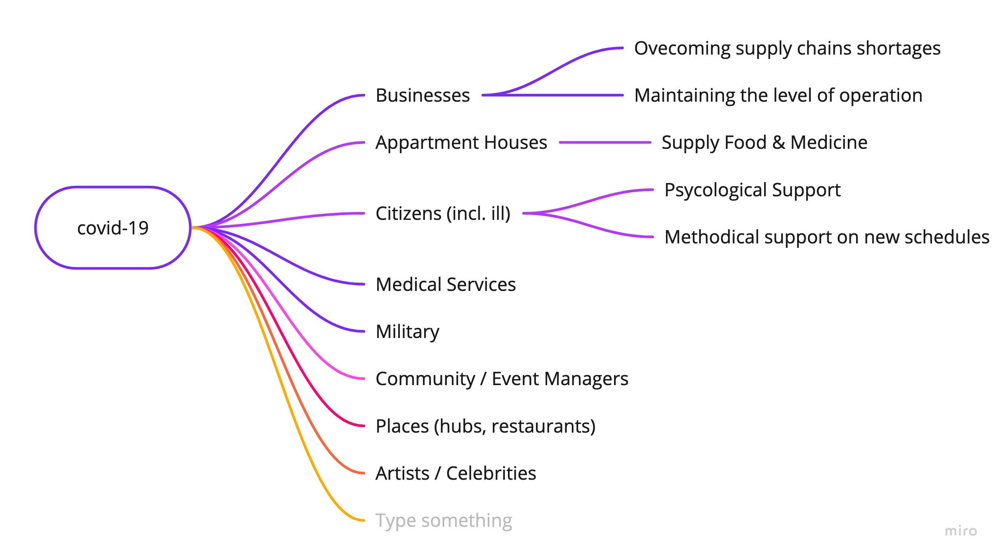

# Координационный центр по остановке коронавируса в Украине


Это база знаний для сбора информации и координации работы по остановке коронавируса. Если вам нужны права для редактирования-обновления –[подключитесь тут](https://app.gitbook.com/invite/dgov?invite=-M2JRBARwkcPd9AED8KT) и действуйте ответственно. [Схема управления тут](upravlenie.md)


Друзья, наша первоочередная задача сейчас остановить распространение вируса и снизить нагрузку на систему здравоохранения. Если мы сможем максимально изолироваться сейчас, то больше людей смогут получить нужную поддержку. В пессимистичном сценарии от 5 до 10% населения могут оказаться в тяжелом состоянии и им нужна будет наша помощь.  Ниже информация о том что происходит и какие действия можно предпринять – как помочь и где получить помощь. 

## Что важно понимать насчет того что сейчас происходит

* [Объясняющий ролик \(англ\)](https://www.youtube.com/watch?v=Kas0tIxDvrg) по эпидемиологии простыми словами за 9 минут. **Ключевой вывод:** число зарегистрированных случаев коронавируса за пределами материкового Китая увеличивается в 10 раз каждые 16 дней. 
* Посмотрев вышеупомянутое видео, вы поймете логику статьи Яши Маунка в [The Atlantic, “Cancel Everything.”](https://www.theatlantic.com/ideas/archive/2020/03/coronavirus-cancel-everything/607675/) **Ключевой вывод:** до сих пор против коронавируса была эффективна только одна мера: крайнее социальное дистанцирование \(сидеть дома, не контактировать без крайней необходимости\). 
* [Технический справочник по Коронавирусу](https://coronavirustechhandbook.com/) представляет собой открытый список ресурсов для граждан-ученых, производителей и других, заинтересованных в изучении того, как помочь". Ключевой вывод: активная коллективная деятельность вокруг ответов на COVID-19 огромна и является важным источником информационных сигналов для рассмотрения. 

Глобальное движение и статистика: [https://www.endcoronavirus.org](https://www.endcoronavirus.org/)

## **Какие будут последствия пандемии COVID-19?** 

* [Венчурный капиталист Азим Азхар обсуждает шесть способов, которыми коронавирус изменит наш мир](https://www.exponentialview.co/p/-six-ways-coronavirus-will-change). Его список включает в себя: открытые источники ранее запатентованной информации о глобальных угрозах, а также рост онлайн-обучения, работы и собраний. **Ключевые выводы:** подготовьтесь к переходу от хрупких глобальных цепочек поставок к «сетевым, децентрализованным и устойчивым» моделям. 
* «Правительства всего мира могут рассматривать этот кризис в области здравоохранения как возможность внедрить или внедрить противоречивые технологии и системы для эпиднадзора», - говорится в отчете [Access Now](https://www.accessnow.org/protect-digital-rights-promote-public-health-towards-a-better-coronavirus-response/). **Ключевой вывод:** вспышка - это возможность «оценить, как мы можем защитить здравоохранение в эпоху цифровых технологий и где наши цифровые права вписываются в глобальные гуманитарные меры». 
* Создание систем, устойчивых к глобальным последствиям пандемий, может иметь далеко идущие преимущества. В этой статье 2010 года, опубликованной в журнале [«Грипп и другие респираторные вирусы»](https://www.ncbi.nlm.nih.gov/pmc/articles/PMC4941659/), перечислены восемь социальных выгод, полученных от разработки эффективных механизмов реагирования на пандемии. **Ключевой вывод:** есть много «потенциальных побочных выгод от планирования и подготовки к пандемии, которые могут быть реализованы независимо от будущей пандемии».

## Вовлеченные группы и стратегия

## Управление пандемией

### Информационная кампания

* Поддержка моего сообщества \(семья, коллеги, дом, все связанные группы\) и замедление распространения. Нужно помочь моему  сообществу пережить шторм. 
* Противостоять распространению вируса 60%+ населения \(у вируса высокий коэффициент распространения, в Китае были введены очень жесткие меры, так они справились\). Медленные или отсутствующие меры предосторожности со стороны правительств, работодателей и организаций
* Люди вокруг все еще думают, что это шутка или заговор. Не воспринимают угрозу серьезно
* Нужно рассказывать про социальное дистанцирование и потребность в расширении медицинского потенциала 

### Усиление потенциала сообществ и гос структур

* Создание эффективных политик
* Открытие и прозрачность данных по распространению вируса 
* Аналитика и предсказание
* Создать эффективную координацию между НГО, правительством и активистами

### Помощь уязвимым слоям населения \(люди на каратн

* Помощь уязвимым слоям населения \(пожилые люди\) – Супервнуки
* [Food and medicine delivery](english/food-and-medicine-supply-chains.md)
* [Anxiety and Psycological Support](english/psychological-support.md)
* Breakdown of supply chains – Enough supplies to go around and alleviating economic pressures \(rent/debts\) so people don’t have to work any but most strictly necessary jobs.
* Stress on the healthcare system – Increasing surge capacity of ICUs and hospital beds.Interested in creating a simple prototype design for renovating vacant buildings to be repurposed for healthcare occupancy quickly and efficiently
* [Other technology](english/tech.md)

### Улучшить доступность тестов и средств защиты

...

## [Переход на удаленную работу](english/moving-events-online.md)

* Changes to daily life
* Workplace impact, employee safety, employee well-being , continuity , work adjustments

## Работа с социологическими и политическими последствиями

* Exponential spread, and the resulting societal, economic and political ramifications
* slow reactions of politicians and public, donwplaying, a general feeling of "it won't happen to me" I sense in many people
* exponential growth due to insufficient testing, no social distancing, and medical professional and media censorship
* ensuring this doesn't reinforce narratives of fear, polarization and "othering"; focusing on government competence and non-governmental initiative
* getting out the word, and making this a positive change process, not reinforcing fear
* long-term health impacts and potential addition to the human ecosystem as a 'constant' threat


 Если вам нужна помощь или вы хотите помочь – подключайтесь в [дискорд](https://discordapp.com/invite/rs8Jyg) \(бесплатный слак\) или [телеграм](https://t.me/stopcovidua)


## Read more

**How can we better prepare ourselves for the next future shock?**

* [Ending Pandemics](https://endingpandemics.org/) is an organization dedicated to the early discovery of infectious disease outbreaks so they can be halted before they become pandemics. **Key takeaway:** “If we prioritize our efforts to find outbreaks faster in animals, it is possible to prevent human infection altogether.”
* In a world of uncertainty, only one thing is certain: shocks, disruptions, and other unsettling events will occur, and they will be novel and surprising. IFTF executive director Marina Gorbis argues in her essay [“The Future as a Way of Life,”](https://medium.com/@mgorbis/the-future-as-a-way-of-life-4bc314ec97de) that the only way to effectively deal with black swan events is through a “massively public endeavor” to envision and make the future. **Key takeaway:** “futures thinking is an essential 21st century skill: we need to cultivate it widely in everything we do.”
* Now, more than ever, it’s time to unstick your mind. “To avoid being blindsided by the future, you must develop mental habits of actively challenging what you believe could or could not be different,” writes IFTF’s Jane McGonigal in her essay, [“Counterfactual Thinking Is the Key to Creativity — and a Vaccine against Future Shock.”](https://medium.com/institute-for-the-future/counterfactual-thinking-is-the-key-to-creativity-and-a-vaccine-against-future-shock-9774a111b996) **Key takeaway:** “to invent something new, or make any kind of change in your society, you first have to be able to imagine how things can be different.”

## Articles

* [Coronavirus: seven ways collective intelligence is tackling the pandemic](https://theconversation.com/coronavirus-seven-ways-collective-intelligence-is-tackling-the-pandemic-133553)
* [I need you to read this and decide about Coronavirus Approaching the pandemic with a systems-thinking lens](https://medium.com/@phoebetickell/i-need-you-to-read-this-and-decide-about-coronavirus-6dd184745b33)
* [The Coronavirus is the Future Shock of the Decade: Three Things You Need To Know](https://mailchi.mp/iftf/news-from-the-future-issue-1478053?e=76e445d5a7)
* \*\*\*\*[Coronavirus — The Black Swan of 2020](https://angel.co/re/story/13514)
* [Coronavirus Tech Playbook](https://coronavirustechhandbook.com/)
* [Library](https://coronavirustechhandbook.com/communities)
* [Get Your Home Ready](https://www.cdc.gov/coronavirus/2019-ncov/prepare/get-your-household-ready-for-COVID-19.html)
* [“Flattening the Curve” is a deadly delusion](https://medium.com/@joschabach/flattening-the-curve-is-a-deadly-delusion-eea324fe9727)
* [https://www.washingtonpost.com/graphics/2020/world/corona-simulator/](https://www.washingtonpost.com/graphics/2020/world/corona-simulator/)
* [Мне нужно, чтобы вы прочитали это и решили, что коронавирус приближается к пандемии с помощью системного мышления](https://medium.com/@phoebetickell/i-need-you-to-read-this-and-decide-about-coronavirus-6dd184745b33)


As a general PSA: this is a novel and confusing situation, and there are genuine uncertainties and differences of opinion. I would strongly encourage every volunteer to express their estimates of the feasibility of various plans as constructively as possible, and to personally focus on whichever task you think is likely to make the greatest difference in the time we have. Thanks, do good work and stay safe.


