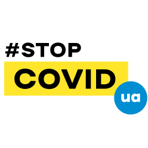

# Координаційний центр по зупиненню епідемії коронавірусу в Україні

> Збільшуйте стійкість суспільства: переорієнтуйте уряди, бізнес та суспільні послуги. [Всесвітня організація охорони здоров'я](https://www.who.int/docs/default-source/coronaviruse/20200307-cccc-guidance-table-covid-19-final.pdf?sfvrsn=1c8ee193_10)

**Наша візія:** Україна без епідемії, мінімальні соціально-економічні втрати

**Наша місія:** створити ефективну координацію між недержавними об'єднаннями, урядом та активістами через відкриту організацію. Будь-хто може [приєднатися](organizaciya/informaciya-dlya-volonterov-onboarding.md) та внести свій вклад.

**Завдання:**

* Збираємо перевірену інформацію про стан в країні та по проєктах, що відбуваються
* [Посиюлємо людей та організації](organizaciya/informaciya-dlya-volonterov-onboarding.md) для через обєдання та сінергі.
* Ініціюємо [потрібні проeкти](./#proyekti)

Здійснюється дуже велика колективна діяльність стосовно викликів навколо COVID-19. Нам потрібна хороша координація та збір сигналів по ситуації для пошуку ефективних рішень. 


[Додавайся тут щоб допомогти](organizaciya/informaciya-dlya-volonterov-onboarding.md)


## Рішення

* [Громадянам](gromadyani.md) \(в тому числі вразливим групам: літні люди, вагітні, люди без доходу\)
* [Психологам, психотерапевтам, психіатрам](psikhologam-psikhoterapevtam-psikhiatram.md)
* [Неприбутковим і громадським організаціям](ngo-obshestvennyi-sektor.md)
* [Медикам](sistema-zdravookhraneniya/)
* [Школам та вишам ](udalennoe-i-onlain-obrazovanie.md)
* [Бізнесу](biznesy/)
* [Медіа, інфлюенсерам, творчим людям](media-inflyuensery-kreatory.md)
* [Донорам](fond-pomoshi.md)
* \*\*\*\*[**Активістам та волонтерам**](organizaciya/informaciya-dlya-volonterov-onboarding.md)\*\*\*\*

##  Проекти

* [Все про коронавірус \(SARS-CoV-2\)](proekti/o-koronaviruse/)
* [Інформаційна кампанія](proekti/informacionnaya-kampaniya/)
* [Психологічна та емоційна підтримка](proekti/psychological-support/)
* [Система постачання](proekti/dostavka-produktov-i-medikamentov/)
* [Аналітична платформа](proekti/analitika-mepping-dannykh.md)
* [Онлайн-курс для медволонтерів](proekti/onlain-kurs-dlya-med-volonterov.md)
* [Збірка та модифікація ШВЛ](proekti/sborka-i-modifikaciya-ivl.md)


Уже щось робите або потребуєте допомоги? [Підключайтесь тут](organizaciya/informaciya-dlya-volonterov-onboarding.md)


## Координаційні центри за регіонамі

* [Рада президента](https://jurliga.ligazakon.net/ua/news/193761_prezident-stvoriv-koordinatsynu-radu-z-protid-poshirennyu-covid-19)
* [Київ](http://kyiv.stopcovid.org.ua/)
* [Одеса](za-regionom/odesa.md)
* [Львів](za-regionom/lviv.md)
* [Запоріжжя](za-regionom/zaporizhzhya.md)
* [Тернопіль](za-regionom/ternopil.md)
* Винница
* Луцк
* Днепр
* Донецк
* Житомир\*
* Ужгород
* Ивано-Франковск
* Кропивницкий
* Луганск
* Николаев
* Полтава
* Ровно
* Сумы
* Харьков\*
* Херсон
* Хмельницкий\*
* Черкассы
* Чернигов
* Черновцы
* Крым


Добавьте центр или создайте свой \(пишите [Максу](https://t.me/maxsemenchuk)\)


### Інші центри і глобальні рухи

* [УВС Волонтерський центр допомоги під час епідемії коронавірусу](https://volunteer.country/covid19)
* Глобальное движение и статистика: [https://www.endcoronavirus.org](https://www.endcoronavirus.org/)
* [Библиотека со ссылками на все движения и материалы \(англ\)](https://coronavirustechhandbook.com/communities)
* [COVID-19 Slack / Discord workspaces \(+ hackathons\) – International list](https://docs.google.com/document/d/e/2PACX-1vS2p8BPJ5d0WcHxRAB0BWCv6fY2lgZPVanfZNqOX4z2e00cOEwPIWhlO5ZNlPb5Fe2Pva_c74leKrR2/pub)
* [https://ucansave.org.ua/](https://ucansave.org.ua/)

## Онлайн-конференції та події

#### [17-21 березня онлайн-хакатон Fix the crisis](https://casers.org/cases/fix-the-crisis)

В Україні сотні й тисячі талановитих людей. Закликаємо студентів, викладачів, маркетологів, програмістів, економістів та всіх небайдужих долучатись до генерації та обговорення ідей. Не час панікувати — час діяти! Беріть участь в онлайн-хакатоні й знайдімо рішення, які допоможуть подолати кризу та її наслідки.

Напрямки: Інструменти допомоги державі та містам, поради бізнесу; інструменти для університетів і шкіл; проєкти для зупинки та/або передбачення розповсюдження коронавірусу; ідеї корисних флешмобів; ідеї для зменшення паніки населення.

[https://casers.org/cases/fix-the-crisis](https://casers.org/cases/fix-the-crisis)

#### [**24 березня Webinar: Negotiating Losses in Times of Crisis**](https://zoom.us/webinar/register/WN_uYQkCM27T5aYOjLgGEmihQ?utm_campaign=7841610&utm_content=3673899887&utm_medium=email&utm_source=Emailvision)

12:00 GMT. Hosted by London Business School, Niro Sivanathan, Associate Professor of Organisational Behaviour

## Підтримайте проєкт та залишайтесь на зв'язку 

* Поділіться матеріалом в соцмережах ❤️
* Сайт оновлюється раз в день - слідкуйте за оновленнями
* [Підпишіться на telegram-канал з оновленнями ](https://t.me/stopcoviduaupdates)
* [Наш інстаграм](https://www.instagram.com/stopcovidua/) та
* [фейсбук](https://www.facebook.com/StopCovidUa) й
* [ютюб](https://www.youtube.com/channel/UC2wd337MNQZCrJ0NST544OA/videos)
* Пошта: [stopcoviduanow@gmail.com](mailto:stopcoviduanow@gmail.com)

