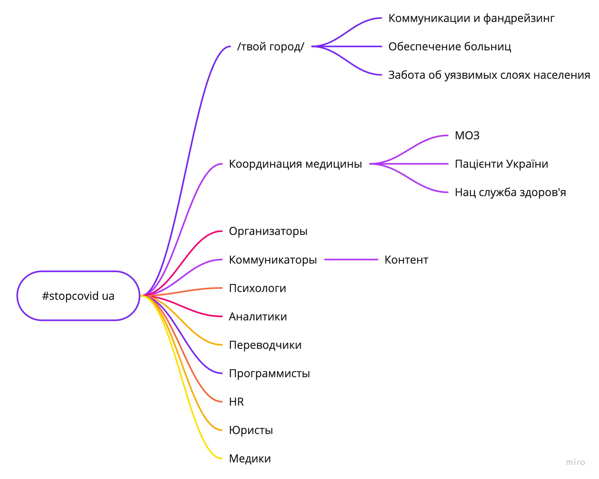

# Організація – як все працює?

## Наши ценности

1. Сохранение жизней
2. Поддержание психологического здоровья
3. Снижение экономического урона
4. Эффективная координация
5. Команда
6. Прозрачность и открытость

Инвестируем время и принимаем решения на основе этих приоритетов.

## Структура роботи

Выбирайте к каким направлениям присоединиться. Посмотрите материалы и дерните вашего лида по поводу задач

* [Координаторам та аналітикам](analitika-mepping-dannykh.md)
* [ЗМІ, комунікаторам та креаторам](informacionnaya-kampaniya/)
* [Психологам, психотерапевтам, психіатрам](psychological-support/)
* [Перекладачам](perekladacham.md)
* [Медикам](sistema-zdravookhraneniya/)


Вам нужен эксперт или член команды? Добавляйте на [доску в трелло](https://trello.com/invite/b/IkonsFAY/12e5d029973f9869061f7a5c1a0364f4/main-board)


## Инструменты

* Работа в команде в [дискорд](https://discord.gg/Ua4nnXZ)
* Свободные обсуждения в [телеграм](https://t.me/stopcovidua)
* Список задач тут [трелло](https://trello.com/invite/b/IkonsFAY/12e5d029973f9869061f7a5c1a0364f4/main-board) \(инвайт в ссылке\)
* Еще [телеграм-канал](https://t.me/scutasks) с задачами
* Файлы в [google drive](https://drive.google.com/drive/folders/1i4TaeHh8V0-WX8paR-xPhDIhl8tvFZTs?usp=sharing)
* [Контакты команды](https://docs.google.com/spreadsheets/d/1aFogfzJFu_4oDbCVGvR0dE2BfQc6m9A1L3_KHz9t8SY/edit#gid=0) \(добавь сюда свои\)
* Используем модель социократии для гибкой работы

### [Карта экспертиз](https://graphcommons.com/graphs/f73f4bd3-041d-42cb-a42b-ec72651d2989?auto=true&layout=fa2)



### [Телеграм чат](https://t.me/stopcovidua)

* Пожалуйста, подключайтесь в дискорд [https://discord.gg/BwaaJV](https://discord.gg/BwaaJV), тут свалка из всего
* Используйте хештеги: \#intro, \#новости, \#психолог, \#деньги, \#медикаменты, \#контент, \#discord, \#помощь, \#созвон
* Новости моз давай просто всіх просити підписатися на [https://t.me/COVID19\_Ukraine](https://t.me/COVID19_Ukraine) і не репостити те, що і так більшість отримуж
* [Статистика](https://combot.org/c/-1001383920031)

### [Дискорд чат](https://discord.gg/AebMHV)



* [Лидерборд](https://mee6.xyz/leaderboard/688064950635462771)

### Формат созвонов

[Каледарь созвонов \(google cal\)](https://calendar.google.com/calendar?cid=dWFjYmxrMG80MGx0amRidGFpb2M0aGVoZmNAZ3JvdXAuY2FsZW5kYXIuZ29vZ2xlLmNvbQ) – добавляй себе чтобы не пропустить.

Созвоны каждый день в 20:00 \(Киев\) в [зуме](https://zoom.us/j/919563955?pwd=VlIrTjZXUHpuQTQrVHlpa09WUnpJUT09) \(добавляем записи youtube\)

1. Каждый называет цель над которой он работает и апдейты. _Например: начать производство аппаратов для вентиляции легких. Обновления: нашел схему и производителя, нужна консультация._ 
2. Каждый может вынести вопрос который продвинет его к достижению цели _Например: как понять куда нужны аппараты в первую очередь?_ 
3. Группа выбирает порядок рассмотрения \(от наиболее важных\) и обсуждаем/предлагаем решения на запрос \(5-10 мин на вопрос\)

Заметки и запись со встречи будет приложена к базе знаний \([пример](organizaciya/tactical-16.03.md)\).

## База знаний

* Постарайтесь не удалять контент, если нужно лучше перенести его в конец страницы с пометкой "на удаление".
* [Права на редактирование можно получить тут](https://app.gitbook.com/invite/dgov?invite=-M2JRBARwkcPd9AED8KT)

## Дизайн и лого

* [Все материалы в figma](https://www.figma.com/file/dL4QqItFu65HFNRwvs80sP/Stop-Covid?node-id=0%3A1)
* [Картинки лого](https://drive.google.com/drive/folders/1yTjYafpFWmkKw7lYOdkMLlyPgBxgsTm5)

## Підтримайте проєкт та залишайтесь на зв'язку 

* Сайт оновлюється кілька разів на день
* [Підпишіться на telegram-канал з оновленнями ](https://t.me/stopcoviduaupdates)
* [Наш інстаграм](https://www.instagram.com/stopcovidua/) та
* [фейсбук](https://www.facebook.com/StopCovidUa) й
* [ютюб](https://www.youtube.com/channel/UC2wd337MNQZCrJ0NST544OA/videos)
* Пошта: [stopcoviduanow@gmail.com](mailto:stopcoviduanow@gmail.com)

## Идеи

* Дать коучей Лидам
* People obligate to volunteer and cant fulfil \(for other reasons\)
* People say but not qualified \(unable to use collaboration practices, don't have the technical expertise
* Local office collab / different mindsets – workshop \(senior who people can trust\)
* 27 regions
* Развивать каждого волонтера
* Онбординг лидеры / Нужно как-то научить лидов
* Более четко описать домены, создание лида / репа
* Серотониновый всплеск закончится – Public better, нужна позитивная цель
* Поискать наративы
* [Уроки и ошибки по координации Майдана](https://rizzoma.com/topic/58b6486fca851222c97f5f30868d7408/0_b_6b0p_4s1t4/)
* Брать консультации у крутых экспертов \(Например Felipe\), просить улучшить организацию
* NVC для работы с будущим конфликтом
* Мартын и игротехники, рефлексивное управление
* Допускать к работе по чеклисту
* Как работать с таким возражением "я по-другому не могу организовываться"
* Обучение фасилитации
* Помощь и забота о команде и волонтерах. Начать создавать роли
* [Матричная структура](https://app.mural.co/t/seductive4559/m/seductive4559/1584954575906/bca4c9353968eebe74ac432bd90a35cd143acecf)
* Волонтер Сервис могут проконсультировать
* Сделать HR-агентство: находить ресурсы для проектов
* Когда не можешь прямо – действуй по-партизански
* Затестить бот от Скуратова
* Найти местные движения через медиков-волонтеров
* В нашей группе должны быть представители всех групп стейкхолдеров
* Молодежные медицинские организации Украины и Европы \(UMSA\) – Андрей
* Юрист
* Сделать чеклист онбординга
* [https://medlabboulder.gitlab.io/communityrule/templates/](https://medlabboulder.gitlab.io/communityrule/templates/)
* Должны входить представители города, бизнеса, НГО, медиа
* Подготовить инструкцию типа франшиза
* Повторяющаяся структура
* Игровая концепция активизма

