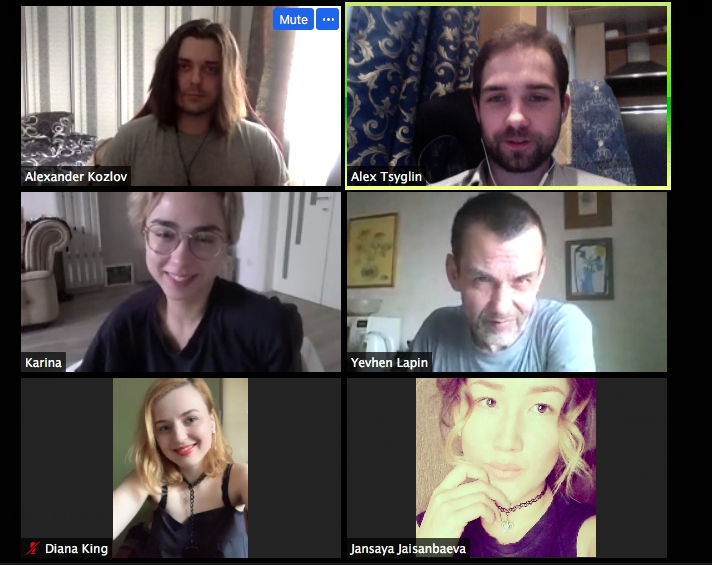

# 09.06.20: Инструменты аналитики, брендинг, повышение вовлеченности участников сообщества.



❇️**Вопросы которые обсуждали:**  
1.Какие инструменты используете для аналитики по сообществам?  
2.Как сделать так чтобы участники группы были заинтересованы в развитии сообщества\(для некоммерческого сообщества\)  
3.Как подойти к вопросу брендинга онлайн сообщества? Что самое важное?  
4. Социальная физика, квантовая психология и социология для развития сообществ

**🔗Полезные ссылки:**

база знаний с инструментами сообществ [https://wiki.reincubator.org/metacommunity/baza-znanii-po-km/optimizaciya-i-povyshenie-produktivnosti](https://wiki.reincubator.org/metacommunity/baza-znanii-po-km/optimizaciya-i-povyshenie-produktivnosti)

**аналитика в движке для сообществ Mighty Networks** [https://faq.mightynetworks.com/hc/en-us/articles/204984099-How-to-Use-the-Analytics-Dashboard](https://faq.mightynetworks.com/hc/en-us/articles/204984099-How-to-Use-the-Analytics-Dashboard) 

[https://wiki.teal.org.ua/resources/spiralnaya-dinamika](https://wiki.teal.org.ua/resources/spiralnaya-dinamika) ****- о спиральной динамике. Желтый уровень в сообществе - каждый участник может быть иниуиатором любой активности в сообществе

Энциклопедия по Социократия 3.0 на русском: [https://about.neoinnovators.ru/library/s3/pattenry-socikokratii-3.0-s3](https://about.neoinnovators.ru/library/s3/pattenry-socikokratii-3.0-s3)

Книга Поток: [https://www.goodreads.com/book/show/66354.Flow](https://www.goodreads.com/book/show/66354.Flow) 

Колесо навыков community manager : [https://media.discordapp.net/attachments/717407540610203711/719952552900296725/unknown.png ](https://media.discordapp.net/attachments/717407540610203711/719952552900296725/unknown.png?width=434&height=431)

Дизайн и планирование сообществ: [https://wiki.reincubator.org/metacommunity/baza-znanii-po-km/planirovanie-soobshestv\#read-more](https://wiki.reincubator.org/metacommunity/baza-znanii-po-km/planirovanie-soobshestv#read-more)

 11 фундаментальных законов построения онлайн-сообществ [http://elearncorpua.blogspot.com/2018/05/11.html](http://elearncorpua.blogspot.com/2018/05/11.html)

"От торговой марки — к иконе"  статье классно описаны как делаются портреты целевой [https://ain.ua/special/brand-lift/](https://ain.ua/special/brand-lift/)

P.S. Если вам интересно участвовать и обсуждать вопросы о развитии сообществ – пожалуйста зарегистрируйтесь тут [https://maxsemenchuk.typeform.com/to/ddlBil](https://maxsemenchuk.typeform.com/to/ddlBil)


## Запись:



## 🎯 Цели и обновления \(Check-In\) 

Сая: Цель собрать команду, есть 2 потенци. продукта а\) консалтинг б\) образоват. продукт. Выстраиваю стратегию по всему Impact UA и понять как продукты можно было интегрировать в экосистему

Карина: цель чтобы закончили обсуждать Business Model Canvas, исходя из полученных результатов могу понять чем буду полезна. Хочется чтобы цель была более конкретной.

Алекс Козлов: Работаю над обновленной версией энджениринга, делаю через Community Canvas \(Purpose, Ритуалы \(контент, роли, правила\)Зеленый организация\) Цели услышать идеи, вдохновиться, узнать что-то новое

Алекс: Группа по финансам, инструменты для аналитики?

Евгений Лапин: ... \(пропустил чекин\)

Diana King: ... \(пропустила чекин\)

## 📝 Вопросы к обсуждению 

### Какие инструменты используете для аналитики по сообществам?

Buidl UA - бот @GrStatsBot

Для discord statbot - минус последние 30 дней только история

Алекс Козлов: Активность трекать: Airtable + касто API 

Хочу трекать активность участников на созвоне

Сая: [https://wiki.reincubator.org/metacommunity/baza-znanii-po-km](https://wiki.reincubator.org/metacommunity/baza-znanii-po-km)

[https://wiki.reincubator.org/metacommunity/baza-znanii-po-km/optimizaciya-i-povyshenie-produktivnosti](https://wiki.reincubator.org/metacommunity/baza-znanii-po-km/optimizaciya-i-povyshenie-produktivnosti)

Слышу от многих людей запрос на платформу 

Минусы телеграма - там тяжело найти сообщения в истории

**Mighty Networks** [**https://faq.mightynetworks.com/hc/en-us/articles/204984099-How-to-Use-the-Analytics-Dashboard**](https://faq.mightynetworks.com/hc/en-us/articles/204984099-How-to-Use-the-Analytics-Dashboard)

Минус движка - нет бэкапов

 Для FB -&gt; В настройках группы должна быть аналитика

### Как сделать так чтобы участники группы были заинтересованы в развитии сообщества\(для некоммерческого сообщества\)

Если практические фреймворки по которым можно высторить систему мотиваторов при которых сообщество будет саморганизовываться и самоулучшаться \(без участия основополагателей\)? Какое у вас был опыт с самоорганизовывающимися сообществами? Если не знаете, то какие у вас идеи на этот счет?	Идеи, мнения.

Сая: разбор соощества по ценностям , заполнить Community Canvas, по одному интегрировать насколько ты записал и проверять насколько оно совпадает с реальностью. Вовлекать участников в совместную разработку Community Canvas

Алекс: Как сделать систему иерархическую чтобы люди могли посмотреть на систему и саим начать деятельности

Евгений Лапин: Желтый уровень спиральной динамики. Вопросы правильности не стоит - каждый инициирует свой проект, и каждый может подключиться к проекту либо нет

[https://wiki.teal.org.ua/resources/spiralnaya-dinamika](https://wiki.teal.org.ua/resources/spiralnaya-dinamika)

Где почитать детальнее: Грейвз, Дон Бек

Карина: на входе в организацию нужно хорошо опрашивать и понимать что участнки по жизни хочет. Я уверена что если личная цель совпадает с тем какая цель организации - тогда он будет проявлять инициативу. Трекать личные цели на входе в сообщество, показывать примеры что можно сделать

Евгений Лапин: когда новичок на входе в сообщество будет сразу получать инструменты влияния \(хотя бы маленькие\) и когда он влияет - он должен получить обратную связь

На этом построено состояние поток, когда человек делает маленьке шажочки и видит свою эффективность, такие сообщества будут расит

Книга Михай "Поток" [https://www.goodreads.com/book/show/66354.Flow](https://www.goodreads.com/book/show/66354.Flow)

Сая: Колесо навыков community manager [https://media.discordapp.net/attachments/717407540610203711/719952552900296725/unknown.png?width=434&height=431](https://media.discordapp.net/attachments/717407540610203711/719952552900296725/unknown.png?width=434&height=431)

Алекс: Workshop по дизайну community - \(сперва узнать у Люси но можно в Пн\) 

* Сая: на нем попробую написать описание в котором я скажу что мы собираем инстурменты, инстурментарий по построению сообществ, и ты сможешь по этим фреймам предложить своему сообществу заполнить и ты сразу начнешь вовлекать участников сообщества
* Карина: работать вокруг конкретного кейса с определенным сообществом. Как бриф: Canvas, что хочешь получить на выходе

Алекс T: S3 [https://about.neoinnovators.ru/library/s3/pattenry-socikokratii-3.0-s3](https://about.neoinnovators.ru/library/s3/pattenry-socikokratii-3.0-s3)

## Как подойти к вопросу брендинга онлайн сообщества? Что самое важное?

Как подойти к вопросу системно 

11 фундаментальных законов построения онлайн-сообществ

Автор - Виталий Озерян Перевод статьи \( источник \) 1.       Онлайн-сообществу нужен администратор. Вам жизненно необ...

 11 фундаментальных законов построения онлайн-сообществ [http://elearncorpua.blogspot.com/2018/05/11.html](http://elearncorpua.blogspot.com/2018/05/11.html)



Алекс Козлов: Слать Emoji которые обсудили заранее с участниками сообщества

Сая: ориентироваться на идентичность сообщества - сугубо личная идентичность под каждое сообщество

Карина: статья о брендах героях - примеры как разные бренды себя позиционируют на рынке 

Бренды это характеристики опыта, которые ты хочешь чтобы получали участники твоего сообщества

"От торговой марки — к иконе"  статье классно описаны как делаются портреты целевой [https://ain.ua/special/brand-lift/](https://ain.ua/special/brand-lift/)

Важно сделать портрет, затем кратко прописать какой опыт ты хочешь чтобы получали люди, и исходя их этого опыта придумать процесс. Этот опыт должен отобразиться в процессах, которые есть в твоем сообществе

Евгений: Я бы сделал сперва согласование ценности 

## Социальная физика, квантовая психология и социология

Александр Козлов: Социальная физика - часть новой социологии, которая изучает динамику социального интеллекта на уровне организайий сообществ и уровней индивидуальных людей

Про коллективный разум, о том как сознательно и подсознательно охотимся на новые идеи

Евгений: квантовая психология и социология - это близко

Тезис: мы не изучаем мир, а создаем в процессе его познания и от нашей установки на нашем восприятие зависит то каким он будет для нас

Вот ссылка на "Квантовую психологию" Уилсона [http://flibusta.is/b/175066](http://flibusta.is/b/175066) По квантовой социологии что-то не могу сразу найти\(\(\( Но читая книжку Уилсона, вы сразу будете понимать, как это работает с социумом\)

##  

Первым обсуждаются вопросы новичков. Но перед этим они кратко рассказывают о себе \(чем занимаются, в чем эксперты и что/кого сейчас ищут\)

## 🤔 Рефлексия \(Closing round\) 

##  

Формат рефлексии: 1. Поблагодарить участников. 2. Какую 1 вещь можно было бы улучшить во встречах 3. С чем ухожу \(min 1 мысль/инсайт\).

Сая: Спасибо, очень рада была услышать запросы, есть много советов и инструментов, еще раз перечитаю и добавлю больше . Что улучшить - стоит ли делать уведомление  заранее \(за 3 дня и за день\) . С чем ухожу: почитаю про квантовую социологию и психологию . Могу посоветовать классную книгу "Социальная архитектура"

Алекс Козлов: получил много новых идей и материалов для изучения. Заранее объявлять чтобы заранее заполняли вопросы - у людей будет понимание какую ценность будут получать с созвона

Идея: Фокус группа - сгруппа людей со схожими задачами, изучают вместе материалы разные по одной теме, и созваниваются раз в пару дней и обсуждают кто вто изучил - Сая - идея книжный клуб

Карина: Благодарна для звонок , уже качаю 2 книжки, буду читаать. Это в ключе того что изучаю сама. Жду воршоп, классно что расширяем форматы.

В анонс перед звонком добавляюла бы вопросы которые уже есть

думаю анонсить надо в 10 утра 

Евгений: благодарен, т.к7 все время в поисках живой свежей крови и вижу здесь струящиеся потоки. Уношу растернянность от того что все что я получил здесь освоить за меяц.  Проблема: что делать в таком объеме информации когда реально сам можешь освоить только 5:. Каким образом с этим оперировать всем сообщееством

Диана: Все дни присоединяюсь к звонкам и молчу, т.к. хочу понять и услышать со стороны что изменилось в сообществе. Все что вы говорите очень интересно, по поводу книжного клуба классная идея может быть было бы прикольно делиться не только с нами инсайтами, но и добавлять интересные идеи в широкую рассылку.

У меня есть парочку форматов других людей как они это делают

## ​[📷](https://emojipedia.org/camera/) Фото с участниками встречи для истории 

