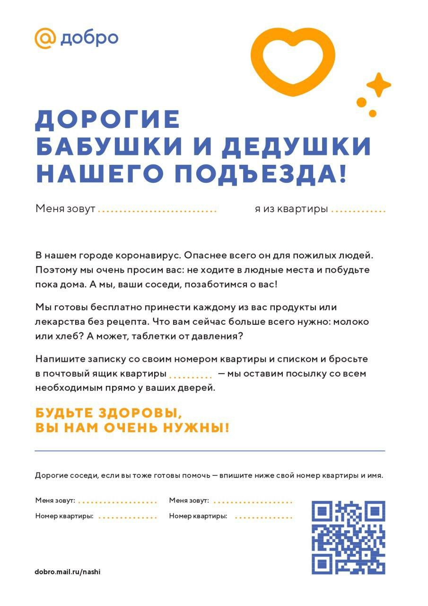
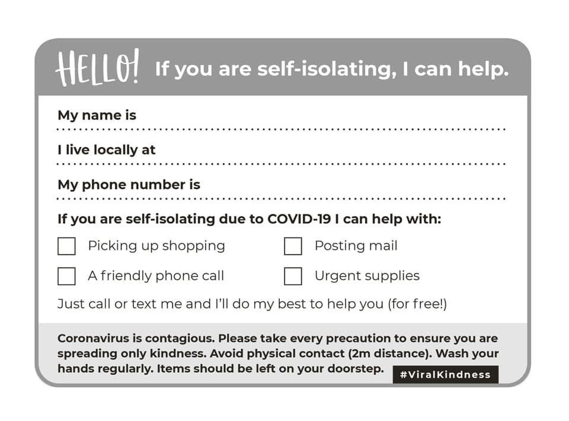

# Постачання продуктів, медикаментів та засобів безпеки

## Солидарность – б**ыстрая координация по запросам**



Сделала анкету для волонтеров-диспетчеров. [https://docs.google.com/forms/d/e/1FAIpQLSdflSNHYdELd-C5yXwGQfcVpTJQos39nWnFAUazDlh860-LWg/viewform?usp=sf\_link](https://docs.google.com/forms/d/e/1FAIpQLSdflSNHYdELd-C5yXwGQfcVpTJQos39nWnFAUazDlh860-LWg/viewform?usp=sf_link) Также нужно будет в каждом городе найти перчатки и маски для водителей. Думаю, по заполненным анкетам будет видна потребность.

> Привет. Зять-медик ежедневно с трудом На общественном транспорте или на такси добирается на работу и домой. Есть Вайбер и телеграмм канал для помощи медикам на бесплатной основе от водителей подвозить. Ни он неудобный - просто вал бессистемных сообщений

## Українська Волонтерська служба



## Життєлюб: Сиди дома!

**Задача:**

* Организация доставки еды, медикаментов, продуктов первой необходимости
* оплата счетов за коммунальные услуги.
* Также нужно улучшить доступность тестов и средств защиты
* для об'єднання зусиль для Ба та Ді, які потребують допомоги
* для координації спільних дій
* прийом запитів про допомогу від фіз. осіб \(продукти, ліки і будь-яка інша допомога\);
* обробка запитів і координація дій \(Хто і що зможе робити\);
* створення інформаційного контенту

**Координатор:**

* Координатор в Штабі від фонду "Життєлюб": [https://www.facebook.com/marina.maricheva](https://www.google.com/url?q=https://www.google.com/url?q%3Dhttps://www.facebook.com/marina.maricheva%26amp;sa%3DD%26amp;ust%3D1584543731036000&sa=D&ust=1584543731049000&usg=AFQjCNEVZC7mCg9IHkWKRrp4jGqUrv0yHA) 
* Якщо можете чимось допомогти: [ia.trudolub@gmail.com](mailto:ia.trudolub@gmail.com)  з поміткою "Можу допомогти»
* Комунікації з фондом "Життєлюб": [https://www.facebook.com/annna.davidenko](https://www.google.com/url?q=https://www.google.com/url?q%3Dhttps://www.facebook.com/annna.davidenko%26amp;sa%3DD%26amp;ust%3D1584543731037000&sa=D&ust=1584543731049000&usg=AFQjCNHMCCsilj3zKKaBnSTYNkN6-P9aQQ) 
* Соціальні мережі фонду "Життєлюб": [https://www.facebook.com/marina.vatulina](https://www.google.com/url?q=https://www.google.com/url?q%3Dhttps://www.facebook.com/marina.vatulina%26amp;sa%3DD%26amp;ust%3D1584543731038000&sa=D&ust=1584543731049000&usg=AFQjCNE14-zD68nQvPJW7fgDrUHwPLsQHw) 

Что это. Организация доставки еды, медикаментов, продуктов первой необходимости оплата счетов за коммунальные услуги.

Зачем Аудитория 50+ самая уязвимая к вирусу, сейчас важно обеспечить их пребывания дома.

Как это работает Фонд Жизнелюб - Обрабатывает заявки от взрослых людей \(еда, медикаменты\) - Составляет карту доставки \(один раз в неделю\) - Организовывает закупку и расфасовку продуктовых наборов Супервнук - оплачивает заявку - развозит наборы по карте доставки

Важно При передаче продуктов соблюдать правила взаимодействия в режиме карантина

[https://cutt.ly/etldLIv](https://cutt.ly/etldLIv)

## Кто может участвовать?

* Волонтеры \([платформа](https://www.volonter.org/), супервнуки, stopcovid\)
* Магазины и рестораны
* ты

## План

1. Анализ рисков и протокол безопасности \(нужны эксперты на каждую группу\)
2. Механизм сбора заявок \(Бланк мне нужна помощь, бланк я могу помочь\)
3. Коммуникация проекта \(в вашем доме есть кто-тот кто нуждается в вашей помощи\)
4. Отчеты


Протокол безопасности:

* помогающим не передавать из рук в руки, оставить под дверью
* нуждающимся не давать доступа в квартиру \(могут быть мошенники\)
* риск: передача личных данных и адресов


## Потенциальные партнеры 

* бізнеси
* громадські організаці
* підприємницькі команди
* соціально відповідальні команди.
* Локальный бизнес \(Лояльность к бренду на карте рабочей территории\)
* Организации по ОСББ
* Производитель средств гигиены, мб Biosphera?
* Муниципалитет
* KyivsmartCity
* Glovo \(мб Uber\) - доставка из супермаркетов
* [liki24.com](https://liki24.com/) – доставка лекарств
* [Доставка The Naked Bar Community](https://docs.google.com/forms/d/e/1FAIpQLSflgozJcJly6XOgP6D72yPGzqJR8eMXGn_VxZWdX6l4mZ9PpQ/viewform)

## Идеи

* [Сделайте плакаты в своем доме](https://www.facebook.com/permalink.php?story_fbid=2828056760610979&id=100002200475958)
* Как найти заболевших?
* Supply Chain
* [https://business.diia.gov.ua/cases/iniciativi/bezkostovni-produkti-ta-poslugi-dla-pidpriemciv-pid-cas-karantinu-cerez-koronavirus](https://business.diia.gov.ua/cases/iniciativi/bezkostovni-produkti-ta-poslugi-dla-pidpriemciv-pid-cas-karantinu-cerez-koronavirus)
* Инстаграм отзывы
* Рисерч масштабируемый модели, нужна успешная ячейка
* Осбб помагать свои с доставкой / Чат осбб, материал для осбб
* Открыть пул волонтёров
* Чаты не работают – нужны быть каналы read only
* Открыть группы местной самопомощи \(города, районы города\)
* Почтоматы
* ЖК организуйте дезинфекцию
* После введения карантина возникли проблемы с [логистикой](https://ru.wikipedia.org/wiki/%D0%9B%D0%BE%D0%B3%D0%B8%D1%81%D1%82%D0%B8%D0%BA%D0%B0), вызвавшие перебои в поставках продуктов, лекарств и товаров первой необходимости. 24 января новостная платформа ThePaper.cn сообщила о значительном \(в 6—10 раз\) росте цен на продукты питания[\[101\]](https://ru.wikipedia.org/wiki/%D0%9F%D0%B0%D0%BD%D0%B4%D0%B5%D0%BC%D0%B8%D1%8F_COVID-19#cite_note-112)
* Мы здесь собрались чтобы активировать локальные сообщества чтобы обеспечить комфорт и безопасность, особенно для уязвимых групп
* Важно – мы не плодим еще один соседский чат
* Названия гайда "Привет, сосед", "Привіт, сусід", "Hi, Nei" \(cозвучно с Honey\)
* Собрать задач со всех направлений, которые можно делегировать волонтерам
* Сделать удобную среду для работы с этими задачами
* Поискать таск-трекеры наиболее подходящие для волонтерских организаций
* по hardware технологиям, вещи которые можно делать в кустарных условиях - медицинские маски - маски N95 - костюмы химзащиты это 100% понадобиться медикам, которые будут в самой гуще
* Договориться за беспроцентные кредиты?

