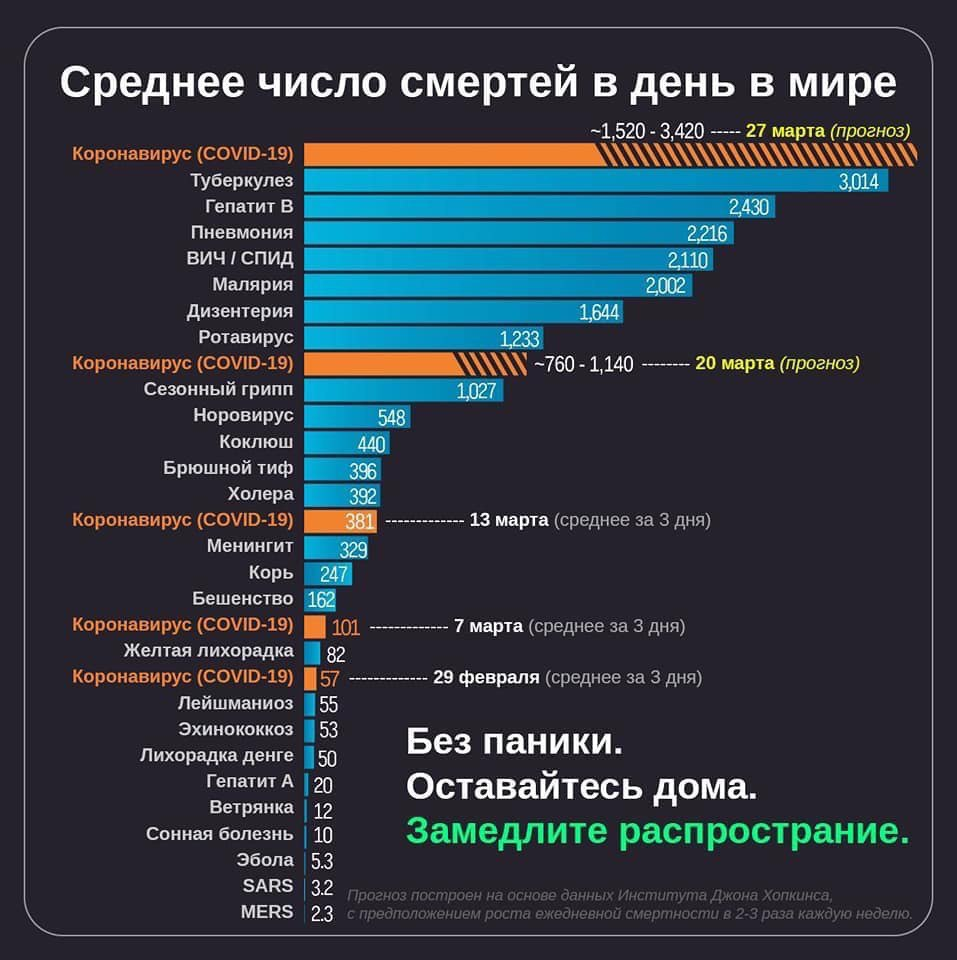

# Все про коронавірус \(SARS-CoV-2\)

## Про вірус

* [Объснение работы вируса от Яна Топлеса](https://www.youtube.com/watch?v=dukR1VXPR1s)
* [Репорт з саміту науковців, присвячений коронавірусу](https://bykvu.com/ua/mysli/samit-naukovtsiv-prysviachenyi-koronavirusu-stezhte-z-bukvamy/) \(вижимка\)
* [Звернення Міністра охорони здоров’я України Іллі Ємця](https://moz.gov.ua/article/reform-plan/terminovo-zvernennja-ministra-ohoroni-zdorov%e2%80%99ja-ukraini-illi-emcja)
* [Коронавирус в России и мире: все, что нужно знать об инфекции](https://reminder.media/longread/koronavirus-v-rossii-i-mire-vse-chto-nuzhno-znat-ob-infektsii)
* [17.03.2020 Брифінг заступника Міністра охорони здоров’я України Віктора Ляшко](https://www.youtube.com/watch?v=7yG3KjoAOcE&feature=youtu.be)
* [Про коронавірус від NIH](https://www.nih.gov/health-information/coronavirus)

## Что нужно предпринять

Вакцины нет, иммунитет будет сам бороться. Можно лечить только симптомы

* [Рекомендации ВОЗ для населения в связи c распространением коронавирусной инфекции \(COVID-19\)](https://www.who.int/ru/emergencies/diseases/novel-coronavirus-2019/advice-for-public)
* [План личных действий от Супрун](https://www.facebook.com/max.semenchuk/posts/10220493542156222?__cft__[0]=AZVzeMSWqj_4hwVO5DysqZHVN3RtkYSYqWJa5jKY6oxEBi81WksCIqQ7y7ohdAgS2B9Pd7fR2O1udM0rrGM4nIyJopLyJHBaWkH3H7DT_rjg8zAlTr_EPZVuxbR0rCJPAqhT2GOQJdNQNXuSa_ekGe0tgWAif5Ph08jXhodrA6ueVMwqGDsEHaGA23WVd0wAjSA&__tn__=%2CO%2CP-R)
* [Когда и как использовать маски \(eng\)](https://www.who.int/emergencies/diseases/novel-coronavirus-2019/advice-for-public/when-and-how-to-use-masks)
* [ГС «Українська Академія Педіатричних Спеціальностей» Щодо ситуації, яка склалась навколо спалаху захворювання COVID-19, викликаного новим коронавірусом SARS-CoV-2](https://www.uaps.org.ua/covid19?fbclid=IwAR1VlRnoGYQAg07bwlt_KnJIfBGreSv9XlD9gT6KxlbRbSoeoqZi_aP-SPQ)

## Мифы \(что не работает\)

[Чистое самоубийство. Французские ученые назвали лекарства, которые нельзя принимать при коронавирусе](https://nv.ua/health/medicine/koronavirus-kakie-lekarstva-nelzya-prinimat-vo-vremya-epidemii-koronavirusa-50075781.html) **Ключевой вывод:** ибупрофен и другие нестероидные противовоспалительные препараты могут осложнить течение болезни

[Coronavirus disease \(COVID-19\) advice for the public: Myth busters](https://www.who.int/emergencies/diseases/novel-coronavirus-2019/advice-for-public/myth-busters)

[В Швеції не лікують...](https://www.folkhalsomyndigheten.se/the-public-health-agency-of-sweden/communicable-disease-control/covid-19/)

## Самодиагностика

[Здається, у мене коронавірус. Що робити?](https://www.the-village.com.ua/village/knowledge/health-knowledge/295233-zdaetsya-u-mene-koronavirus-scho-robiti) Не у всех больных есть симптомы

## Распространение

Открытие и прозрачность данных по распространению вируса. Есть [вот эти данные](https://public.tableau.com/profile/publicviz?fbclid=IwAR2nTNZDiO-GM-y2940gWCCB19xfN8X1yJMVnx0grp-OHoY6xZAT_wylyUk#!/vizhome/monitor_15841091301660/sheet0), но нужно понимать что далеко не все случаи зафиксированы. На вчера тесты были только в паре областей. Можно сравнить [с европейскими данными](https://who.maps.arcgis.com/apps/opsdashboard/index.html#/a19d5d1f86ee4d99b013eed5f637232d) и [данными Оксфордского университета](https://ourworldindata.org/coronavirus)

* Больше моделей и визуализаций в статье [Washington Post](https://www.washingtonpost.com/graphics/2020/world/corona-simulator/)
* [Объясняющий ролик \(англ\)](https://www.youtube.com/watch?v=Kas0tIxDvrg) по эпидемиологии простыми словами за 9 минут. **Ключевой вывод:** число зарегистрированных случаев коронавируса за пределами материкового Китая увеличивается в 10 раз каждые 16 дней. 
* Посмотрев вышеупомянутое видео, вы поймете логику статьи Яши Маунка в [The Atlantic, “Cancel Everything.”](https://www.theatlantic.com/ideas/archive/2020/03/coronavirus-cancel-everything/607675/) **Ключевой вывод:** до сих пор против коронавируса была эффективна только одна мера: крайнее социальное дистанцирование \(сидеть дома, не контактировать без крайней необходимости\). 
* [Технический справочник по Коронавирусу \(англ\)](https://coronavirustechhandbook.com/) представляет собой открытый список ресурсов для граждан-ученых, производителей и других, заинтересованных в изучении того, как помочь". **Ключевой вывод:** активная коллективная деятельность вокруг ответов на COVID-19 огромна и является важным источником информационных сигналов для рассмотрения. 

## Вакцина и лечение

* [Коронавирус SARS-CoV-2 или COVID-19: клиническая диагностика и лечение ](https://proautism.info/sars-cov-2/#Kliniceskaa_harakteristika_i_diagnostika)
* [«В мире нет лекарств от коронавируса», — Минздрав предостерегает от мошенников](https://nashkiev.ua/novosti/v-mire-net-lekarstv-ot-koronavirousa-minzdrav-predosteregaet-ot-moshenikov.html)

## Больше информации

> У меня уже первый вопрос - куда обращаться иностранцам при ухудшении самочувствия? Есть какая то инфа?

* [Официальный телеграм канал МОЗ Украина](https://t.me/mozofficial)
* [Википедия по пандемии covid-19](https://ru.wikipedia.org/wiki/%D0%9F%D0%B0%D0%BD%D0%B4%D0%B5%D0%BC%D0%B8%D1%8F_COVID-19)
* [Гарячая линия](https://moz.gov.ua/garjachi-linii)

