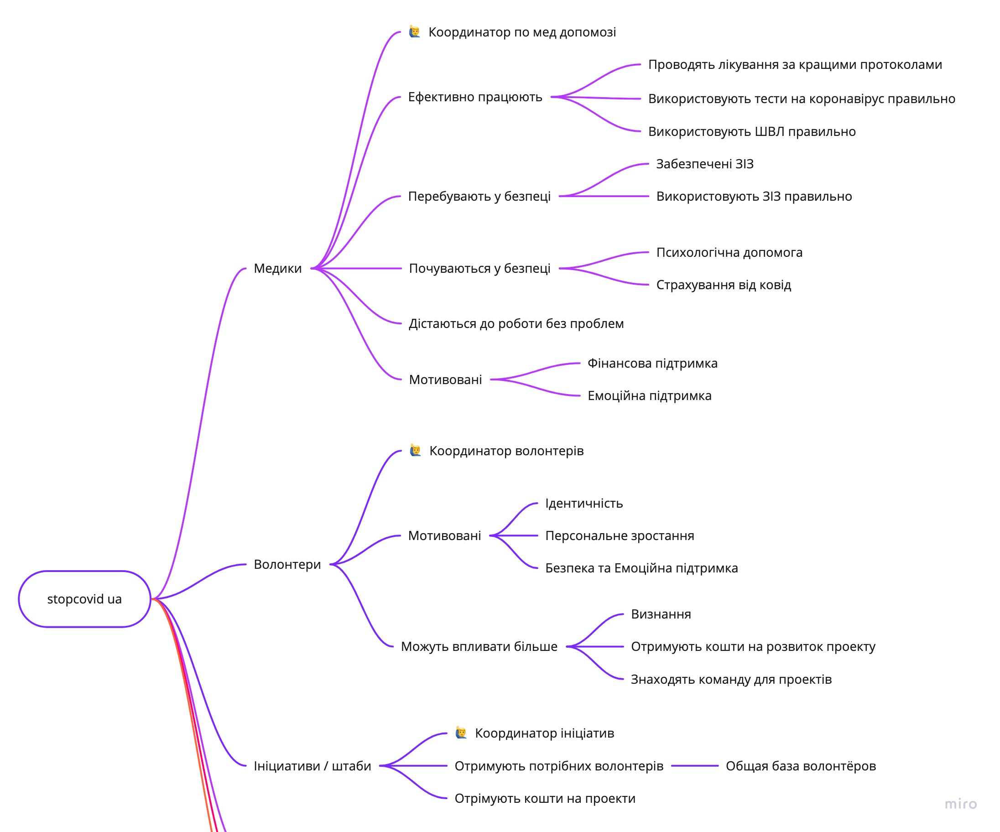

# \#stopcovid ua - тиждень 15

Привіт!

Ми трохи змінили нашу структуру работу \(знов!\), тепер вона виглядає так:

Ми фокусуємося на чітких змінах у стейкхолдерах щоб досягти реального впливу на ситацію. Схема буде доповнюватись, ще є незахіщені весртви населення, безробітни та бізнес. Будемо раді почути що можна покращити, а покі звітуємо по оновленнях за останній тиждень.

## Медикам

[Youcontrol](https://youcontrol.com.ua/virus/) надав інформацію щодо забезепечення лікарень необхідними речами. У Івано-Франковській та Рівненьских областях найгірша ситуація – забезпечення на 2.5 дні. Ви можете допомогти локальним штабам в [Франковську](https://www.facebook.com/groups/1530428180455351/) та [Рівному](https://www.facebook.com/RivneODA/).

Також є інформація про те що не завжди медики знають про використання засобів захисту, дезинфекції тощо. Одеський штаб готує відео навчання для лікарів. Те ж з апаратами ШВЛ – дуже мало спеціалістів й є велике різномаїтття апаратів. Ми вивчаємо та готуємось до перекладу інструкцій до потрібних моделей. Наразі:

* Перевели важливі частини протокола лікарні Гарвардського університету
* Перевели кілька протоколів від Тини Голобородько
* Перевели першу інструкцію на додаток ШВЛ
* Додалися коло 10 людей до групи матеріалів та перекладу, в тому числі прийшли з Одеського Штабу, який оцінює нашу силу та експертизу в цій роботі

🙏Алексу Баїру та всій команді перекладачів

Психологічній корпус вже надав консультації для 10 медиків та проводиться навчання кризовій допомозі для 50+ психологів волонтерів.

🙏Сая Жайсанбаєва та всій команді психологів

По транспорту – найбільш вживаним засобом є viber-групи у регіонах. Багато медперсоналу не є просунуті у технологіях, й частіше використовують телефон. В Київської групи багато роботи проходить вручну. Ми вавчаємо існуючі додатки щоб розробити рекомендації до більше ефективного застосування.

Координуємо роботу мейкерів для [3Д прінтінгу необхідних компонентів](https://docs.google.com/spreadsheets/d/1LSrMHVZWNdZMiOZv5MydVnPI5KJKIFxeg0H85GHgJaU/edit#gid=0) для лікарень. 🙏Михайло Недоляк

## Волонтерам

Ми ініціювали новий [напрям по допозі людям що втратили роботу](vrazlivi-verstvi-naselennya-1/hr-bezrabotica/). 

Також працюємо зараз над 2-ма [запитами на фандінг](https://trello.com/b/fCpPgkFh/funding) – для навчання психологів та медійний проект з Bird in flight.

Пройшов [перший дзвінок з медичної допомоги](medikam/sistema-zdravookhraneniya/13.04.md).  

