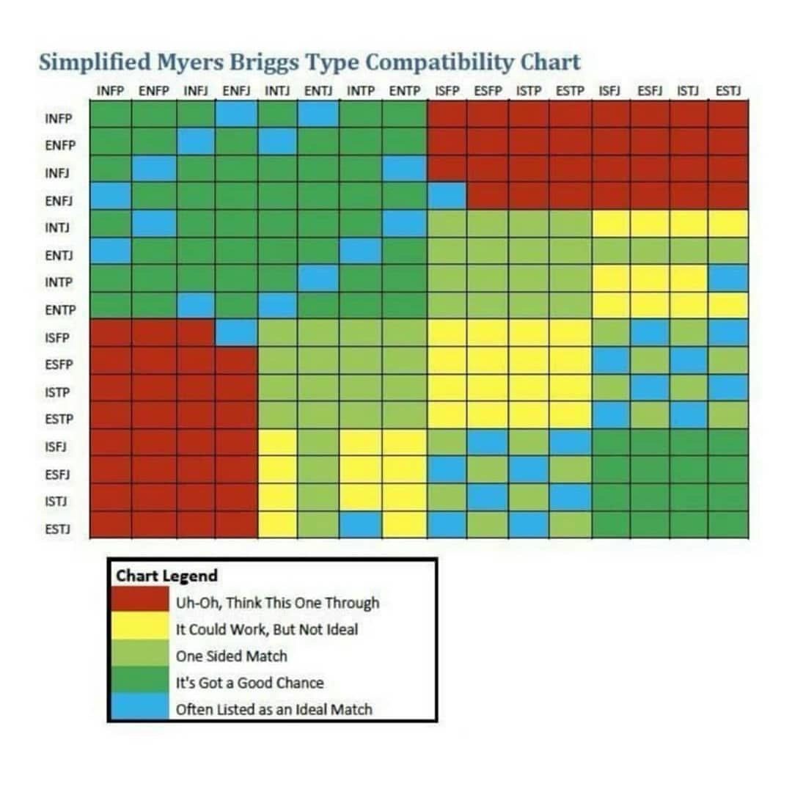

# Інкубатор

## Цілі

Создать больше новый эффективных предприятий. Создать устойчивые проекты в экосистеме. Дати можливість учасникам школи долати складності у реалізації ідей через об'єднання ресурс

* Привлечь менторов, коучей и психологов для помощи в релизации целей команд \(Промо экспертов в сообществе\)
* Проект с ПРООН
* Проект с Министерством цифровой трансформации
* Описать кейс Карины
* Описать кейс НГОшек которые мы консультировали

## Принципы

* VCs are broken: [we need more Zebras, than Unicorns](https://www.entrepreneur.com/article/322407)
* Traction first: story, emotions, brand and community before the product
* Real collaborative work with peers, investors and advisors
* [Социальное предпринимательство](https://wiki.reincubator.org/metacommunity/baza-znanii-po-km/monetizaciya-soobshestv#socialnoe-predprinimatelstvo)
* В обычной команде все должны быть заняты, нет места инновации. Нужна команда-сообщество \(100+ человек\)
* Работаем над тем чтобы у сообщества появилось новое умение
* Вместе пишем историю, метанаратив, мифологему
* Главная ценность инкубатора - нетворкинг
* We have no employees. We only have business partners. We don't work, we create.

## Проекты



## Сервисы и монетизация 

* продавать B2B сервис развития сотрудников ++
* проводить платные ивенты +
* платные курсы +
* Маркетплейс по услугам / продавать воркшопы \(купить для своего продукта, а поучаствовать бесплатно или дешевле\) +
* инкубатор: знакомить людей по работе в школе за процент
* спонсорство / кобрендинг
* подписка на специалистов \(психологов, менторов и тд\)
* Patreon донейшены
* Помогать находить инвестиции \(за фи или в долю\)
* Делать мерч

### Внутренние продукты, сервисы и воркшопы

* Страт сессия
* Сессия дизайн мышления / продукт
* Переводы
* Психологическая конльсутация
* Креативный воркшоп
* Аджайл спринт
* NVC сессия
* Коучинг
* Менторинг
* Мастермайнд
* Фандинг аппликейшен
* Product Model Canvas
* Business Model Canvas
* Community Canvas
* Future Backwards

## Організаційна структура

### Модульна організаційна структура

* Сделать совместные проекты с каждым из сообществ - типа консультационное сессии
* Повторяющаяся структура
* Подготовить инструкцию типа франшиза
* Ройалти за разработки и программы

### Малі самоорганізовані команди

* Минимум 3, оптимально 5, максимум 7
* Фасилитация
* Рекорд кипинг и база знаний
* Динамичные роли

### Виникаючі команди

New teams at all three companies emerge in an organic manner, initiated by entrepreneurial employees. New teams only start when a group of employees gets excited about pursuing an opportunity or solving a specific problem. A new team is only launched when a group of employees is convinced that there is a demand for it. Thus, new teams emerge and grow in a free-flowing, bottom-up fashion.

Программы которые поддерживают:

* Ініціативи. Навіть ті ініціативи, що зазнають невдачі.
* Підтримка інших. Насправді саме це вкрай важливо. Я часто наголошую, що допомога іншим досягти успіху така ж цінна, як ваш власний успіх.
* Креативність та обмін ідеями.
* Допомога людям дати собі раду.

Рост через проекты сообществ

## Процессы

* Если кто-то нужен - делаешь пост в фейсбуке мы его репостим
* Ментор: Коммуникации 20 имён которые нам нужно найти
* ...

## Maturity Level & Development Plan

\(c\) [Nathan Snyder](https://www.linkedin.com/in/nathanvsnyder/)

1. Marketing and Communications – Cross-channel and cross-platform meme-making.
2. Membership and Volunteer Coordination – Building invitations, initiations, and portals for new members and supporters. 
3. Operations and Finance – How do we execute while efficiently coordinating between labor-capital and capital-capital?
4. Political Strategy Design – How do we relate to political persons of interest?
5. Strategic Partnerships – How do we relate to non-profits, NGOs, and corporations?

Let’s say these 5 functions which comprise the administration had within them 5 levels of task complexity associated with the work objectives of each function. Here are examples of how to organize that:

| Level | Comms | Leadership | Ops/Finance | Strategy | Partnerships |
| :--- | :--- | :--- | :--- | :--- | :--- |
| 1 | Writing Tweets or designing landing pages | Enacting membership or being among SOPP body | Tallying the SOPP ledgers at a functional level  | Systems/stakeholder mapping at and below the municipal level  | Dialogue building within mission and vision of org/institution |
| 2 | Setting campaign standards across channels for continuous improvement | Implementing systems of membership, measuring and reincorporating results  | Designing and implementing systems of accounting & Opps efficiency | Building and measuring the results of coalition movements beneath the state level | Designing the systems of content-structure mapping  |
| 3 | e2e redesign of comms method  | Redesigning entire systems/processes + initiations of membership and inclusion  | Redesigning entire ledger across the spectrum  | Making new oppositional unities of existing and dormant political camps | Redesigning the systems of partnership making  |
| 4 | Redefining meta-strategy of comms  | Identity and inclusion making and leadership  | Privately  & public finance making socio-technical systems making | Assuming leadership positions as an overt and covert actor within the existing system  | Hosting executive. level partnerships relations  |
| 5 | Transformation of entire SOPP comms function including historical recasting  | Meta-sovereignty and cooperation stewardship/re-definition of historicity  | Trans-capital leadership and influence  | Leading new political practice | Making new institutions of partnership |

## Вибудовання стратегії

### Рада стейкхолдерів

* В нашей группе должны быть представители всех групп стейкхолдеров \(представители города, бизнеса, НГО, медиа...\)
* Строить общую картинка будущего
* Решение стратегии через кейсы / casers

### Довгострокові цілі

* Это нетворк
* Делать через воркшопы
* Организация формируем вопрос


Осяжний: вам потрібно окреслити цілі, яких ви хочете досягти, коли вони будуть досягнуті та в який спосіб.

Гідний довіри: Після того, як ви презентували свою дерзновенну мету, вам слід презентувати її як цілком придатну до втілення. Додаткові бали ви отримаєте, якщо ніхто раніше нічого подібного не робив. 

Мобілізуючий: Повинен бути простір для участі кожного глядача, який зацікавиться ідеєю, і вони повинні зрозуміти це, просто почувши про проект. 

Епічний: Насамкінець, вам слід оголосити про наміри змінити весь світ на краще – або принаймні досягти суттєвого покращення в житті багатьох людей.


* [How Open Source Projects Survive Poisonous People](https://www.youtube.com/watch?v=ZSFDm3UYkeE)
* Ретроспективы
* Коммуникация в нашем ключе
* Записывать в мемы
* Document History

## Розподіл завдань

### Stakeholder-facing and support teams

* Программа онбординга волонтеров
* Смоделировать волонтерский опыт 
* Улучшить флоу онбординга для новенького
* Сделать чеклист онбординга

### Self-selected task commitments

Ви помітите, що ми говоримо про зміни світу у формі "ми". Це основне. Ніколи не буде "Мені потрібно, щоб хтось зробив Х" або "Вам слід зробити Х". Є лише "Ми всі хочемо, щоб сталось Х". Не треба ні на кого вказувати чи бодай натякати на те, хто це має зробити. Хтось зробить.

Якщо ви робите дію зручною для людей і якомога знижуєте планку, все відбудеться саме так, як ви навчили людей. Слід зробити так, щоб перед кожною задачею людей дуже прямо й детально проінструктували про кожну частину дії – як в інструкціях, описаних у цьому розділі. Це – пряме лідерство. \(уровень задач\)

Наступна стадія та тип лідерства застосовуються, коли люди освоїли основні дії, але їх турбує брак контексту. Вони не бачать перед собою дороги й не відчувають прогресу. На цій стадії слід відповитися від прямого лідерства і вдатися до заохочення і пояснень того, чому ці дії призводять до позитивних результатів. \(уровень целей\)

> - Ти не вчиш мене карате! Ти просто використовуєш мене, щоб я фарбував твій паркан!  
> - Тримай руку!

Третя стадія настає, коли людина добре володіє необхідними навичками, але досі не почувається комфортно. Вона має всі необхідні вміння, але ще не знає цього. Тут потрібен третій стиль лідерства – по суті, нескінченне заохочення. \(уровень ценностей и  принципов\)

> - У мене ніколи не вийде! \(робить сальто назад зі стійки\)

Нарешті, четверта й кінцева стадія – коли хтось мотивує себе сам і покладається на себе. На цій стадії він піднявся й тепер рівний вам, не потребуючи підтримки. Тут важливо тільки, щоб ви періодично визнавали його заслуги, коли він зробить трохи більше, ніж завжди. Єдине, про що слід пам’ятати – визнавати додаткові заслуги тільки коли це справді додаткові заслуги – ніхто на цій стадії не хоче, щоб його хвалили за якісне виконання тривіальних завдань. \(уровень миссии\)

* Нарезать работу на кусочки по 1-2 часа
* Использовать доски трелло и прозрачный процесс
* Никто не навязывает задачи
* Краудсорсинг

### Natural leadership roles

* Добрий проектний менеджмент – це не стільки менеджмент, скільки лідерство.
* Лідером, на відміну від менеджера, не призначають. Лідерство – це даність групової психології.
* Лидеры/представители выбираются участниками внутри

## Ідеї

* Таблеточки как пример/адвайзор
* Разные горизонты планирования - разный размер анализа \(страна, регион, мир\)
* Разные сценарии для стратегии
* [http://www.cloudwatcher.ru/](http://www.cloudwatcher.ru/)
* [https://te-st.ru/](https://te-st.ru/)

## Координація

### Direct person-to-person interaction

* Все могут говорить со всеми \(в тч на открытых звонках\)
* Оверкомьюникейт – звонок лучше чем текст
* [https://thedecider.app/](https://thedecider.app/) – как принять решения

### Digital tools

* Общий канал коммуникации \(рассылка + пост\)
* Отчет в фейсбуке с тегами
* Аналитические статьи с 1 выводом
* Подключить все регионы \(24-27\)
* Брать ресурсы из глобального движения – выжимку инсайтов
* Найти местные движения через медиков-волонтеров
* Фасилитационная рада, а решения в loomio
* [http://covid19.aspeninstitutekyiv.org/](http://covid19.aspeninstitutekyiv.org/)

### Rules of the game

Перший спосіб - організаційний. Він означає, що ми унеможливлюємо ситуацію, коли одна людина визначає, що слід робити іншій людині. Ніхто нікому не каже, що тому треба робити. Це норма для нас. Деякі люди називають це «[дієкратія](https://medlabboulder.gitlab.io/democraticmediums/mediums/do-ocracy/)». 

Другий ефективний метод – це процес консенсусного прийняття рішень, де будь-хто може накласти вето на подальше просування певної справи. Цей метод більш затратний, але може \(і повинен\) застосовуватися у рідкісних та ретельно визначених сценаріях.

Правило 3х пиратов: если 3 пирата договорились вместе – они могу действовать от имени организации

Работа с конфликтами: метод разбора спора по 60 секунд

Голосование как последняя мера

Приоритеты в работе

**Работа над запросами членов круга важнее, чем выполнение задач:** Исполняющий Роль должен отдавать приоритет работе над запросами, поступающими от Членов круга, перед выполнением собственных Следующих Действий. Однако, исполняющий Роль может временно отложить обработку запросов до того момента, когда они накопятся и появится возможность обработать все запросы сразу в более удобное время, если это приведёт к разумной задержке. Работа над запросом подразумевает выполнение обязанностей, описанных в этом разделе - то есть, анализ сообщения, определение и фиксация Следующих Действий и Проектов там, где это целесообразно, и при поступлении соответствующей просьбы, уведомление о том, каким образом была проведена работа над запросом. Работа над запросом не подразумевает выполнение зафиксированных Следующих Действий и Проектов, и правило расстановки приоритетов на вышеуказанные действия не распространяется.

**Встречи важнее, чем выполнение задач:** По запросу одного из Членов круга, исполняющий Роль обязан считать посещение любых встреч Круга, предусмотренных данной Конституцией, более важным, чем выполнение собственных Следующих Действий. Однако, возможно отказаться от посещения собрания, если у исполняющего Роль уже есть планы на это время, или если приглашение было получено на целую серию однотипных встреч, а не на одно конкретное.

**Нужды Круга важнее, чем индивидуальные цели:** Оценивая, как распределить свое время, внимание и другие ресурсы в процессе работы в Круге, исполняющий Роль обязан приводить свою деятельность в соответствие с любыми официальными Стратегиями Круга или определенными Кругом приоритетами, например, теми, которые установлены Лид-линком.

## Проекты

* Рейтинг инициатив по эффективности вложений
* [Проект с Bird in flight по фоткам](https://docs.google.com/document/d/1JjpLPZbaBmBfGJZ5zVaTnOOLtyP64TbI0k9lImD9qwU/edit#)
* Чемпионат по кибериграм среди звезд
* Обучение психологов кризисному консультированию

## Идеи

* [https://www.imf.org/en/Topics/imf-and-covid19/Policy-Responses-to-COVID-19?fbclid=IwAR3LssTJIa49qbxsfgthz4SyWAnUEtPFfo-rE71isFL5AN4\_7YKSNEMiWUI](https://www.imf.org/en/Topics/imf-and-covid19/Policy-Responses-to-COVID-19?fbclid=IwAR3LssTJIa49qbxsfgthz4SyWAnUEtPFfo-rE71isFL5AN4_7YKSNEMiWUI)
* [Applications welcome from startups and SMEs with innovative solutions to tackle Coronavirus outbreak](https://ec.europa.eu/info/news/startups-and-smes-innovative-solutions-welcome-2020-mar-13_en)
* [ЄС оголошує конкурс інноваційних рішень для боротьби зі спалахом коронавірусу](https://euprostir.org.ua/opportunities/148570)
* [https://www.irf.ua/contest/konkurs-grantiv-dlya-protydiyi-koronavirusu-lyudyanist-i-vzayemodopomoga/](https://www.irf.ua/contest/konkurs-grantiv-dlya-protydiyi-koronavirusu-lyudyanist-i-vzayemodopomoga/)
* [https://download.joinfightback.com/FightbackCorona.pdf](https://download.joinfightback.com/FightbackCorona.pdf)
* [https://www.antler.co/covid19-call](https://www.antler.co/covid19-call)
* Из фонда видродження \(на саму структуру\)
* [https://www.irf.ua/contest/konkurs-grantiv-dlya-protydiyi-koronavirusu-lyudyanist-i-vzayemodopomoga/](https://www.irf.ua/contest/konkurs-grantiv-dlya-protydiyi-koronavirusu-lyudyanist-i-vzayemodopomoga/)
* [https://www.prostir.ua/?grants=prohrama-kanadskoho-fondu-pidtrymky-mistsevyh-initsiatyv-reahuvannya-na-covid-19&fbclid=IwAR0ip9ysK5lIR8kYeDhqTZkZ425xpqImd-CBnhvZoRzICw9nQzXVfGffr9Q](https://www.prostir.ua/?grants=prohrama-kanadskoho-fondu-pidtrymky-mistsevyh-initsiatyv-reahuvannya-na-covid-19&fbclid=IwAR0ip9ysK5lIR8kYeDhqTZkZ425xpqImd-CBnhvZoRzICw9nQzXVfGffr9Q)
* Через волонтерство делать маркетинг
* Свят финансирование
* Усилить сбор денег помощью бизнеса
* CLR Gitcoin но без крипты
* Фандинг как на гиткоине
* Донейшен как на патреоне - повторяющийся \(можно скоординировать в спильнокоште\)
* Распределять с помощью адвайзоров
* Бизнес 100
* Спильнокошт
* 2 Patreon campaign
* Писать имена людей которые дали с тегом в фб
* Попросить денег на тест по базовому доходу
* Использовать 10% бюджета в месяц / Попробовать в 1 отделе
* Познакомиться с донорами \(Usaid, giz, sustainable development goals\) + карта
* подавайстесь на Ukraine Start-up Fund - 25к або 50к баксів. жива тема, зрозуміла подача usf.com.ua
* Весь бюджет решаем вместе как направить, через квадратичеакое голосование
* Поддержать стопковид на патреоне
* Благотворительный Метафест в онлайне
* Грант: мб Фёдоров продаст месячное спонсорство? аукцион
* Открыть наши сервисы как апишки / сработать. С  Игниным из бидла
* Проконсультироваться с крутым hr
* [https://www.toptal.com/remote-work-playbook](https://www.toptal.com/remote-work-playbook)
* Таймбанк
* [https://www.upstock.io/product](https://www.upstock.io/product)
* Nesta грант
* Реалити шоу про укр стартапы - последний герой
* Ritual dissent переделать под онлайн
* партнеры стартап инкубаторы \(лифт?\)
* casers
* Инкубационные звонки по темам
* Воркшопы на проекты / идеатоны
* Кинуть запрос с группу BA/PM etc
* [https://opencollective.com/](https://opencollective.com/)
* [https://medium.com/dgov/what-is-distributed-governance-3b103eb082c0](https://medium.com/dgov/what-is-distributed-governance-3b103eb082c0)
* Metacartel
* [https://leader-id.ru/points/](https://leader-id.ru/points/)
* VC chatroom
* [https://socialenterpriseinstitute.co/](https://socialenterpriseinstitute.co/)
* Скрам мастер
* 2х недельная акселерацмонная программа для команд
* Психолог на команду
* dgov foundation
* Rickard Falkvinge
* Запрограмить первые 5 воркшопов
* Заинтересовать общественность тогда придут деньги
* Показать полноту команды по типажам
* 1991 подключить
* [https://usf.com.ua/accelerator-accreditation/](https://usf.com.ua/accelerator-accreditation/)
* [http://www.socionics.com/rel/relcht.htm](http://www.socionics.com/rel/relcht.htm) – matching between sociotypes
* [https://finance.yahoo.com/news/startup-helping-employees-learn-other-130000848.html?guce\_referrer=aHR0cHM6Ly93d3cuZ29vZ2xlLmNvbS8&guce\_referrer\_sig=AQAAAGnngP9V\_vdw8v9WMxVOKoIFW\_Z-01aMbJmCEl2lQgXkmfPiqlb\_Li9z15OMmxztDaM6QhcEp1gH6LVzhXhLo9kwOqOAywAtCGkqZemvfPg-71OHzEzv83sr7kM1znJ8g1epScam5dHSp5SsW-kdZ1t-8xiYDonmBj64i6\_kPf5L&guccounter=1](https://finance.yahoo.com/news/startup-helping-employees-learn-other-130000848.html?guce_referrer=aHR0cHM6Ly93d3cuZ29vZ2xlLmNvbS8&guce_referrer_sig=AQAAAGnngP9V_vdw8v9WMxVOKoIFW_Z-01aMbJmCEl2lQgXkmfPiqlb_Li9z15OMmxztDaM6QhcEp1gH6LVzhXhLo9kwOqOAywAtCGkqZemvfPg-71OHzEzv83sr7kM1znJ8g1epScam5dHSp5SsW-kdZ1t-8xiYDonmBj64i6_kPf5L&guccounter=1)
* Собрать 100 адвайзоров
* Taiwan’s success has rested on a fusion of technology, activism, and civic participation.
  * Булавинова
  * Гурский
  * Тычкивская
  * Сапрыкина
  * [WEF Covid Action Platform](https://toplink.weforum.org/discover/a0e0X00000hzu34QAA/covid-action-platform/overview)
  * Think Tank
  * Емченко
  * Институт будущего партнерство
  * Сразу создавать вопросы на кворе в определенном канал

