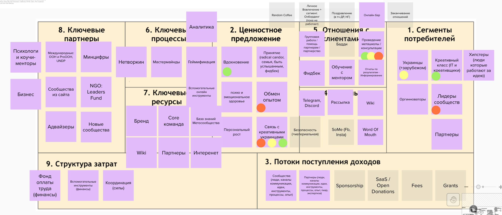
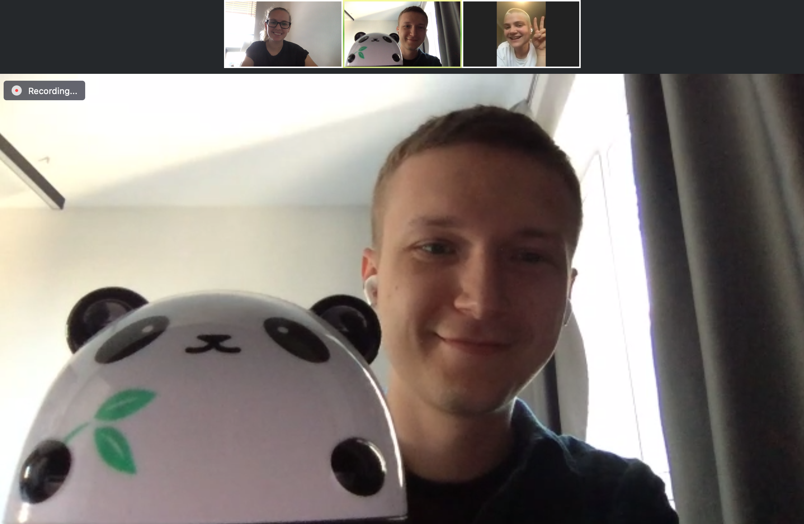

# 08/07 Финальное обсуждение Business Model Canvas сообщества




❇️**Вопросы которые обсудили:**  
1. Финализировали обсуждение Канвы для сообщества Impact UA \(Ключевые ресурсы, ключевые партнеры, структура затрат\)

2. Договорились раз в два месяца делать встречи по Канве, чтобы отслеживать прогресс, изменения, визуализировать текущее состояние организации и видеть ее сильные и слабые стороны. Люся создаст в календаре аналочичные сегодняшней встречи \(начало месяца, среда, раз в два месяца, 19:00\)

3. В качестве домашней рефлексии предложено всем еще раз взглянуть на Канву и убедиться, что у нас существует связь между всеми ее компонентами. Особенное внимание стоит удалить связи 

Потребитель - Ценностное предложение - Доход

4. Второе задание для рефлексии: 

* выписать по 3 самых сильных поинта \(связь, компонент, источник и т.д\), которые могут усилить организацию, если им уделить больше ресурсов.
* Выписать по 3 слабые стороны организации, которые выявила Канва

Эти мысли можно добавить в данные документ:  [https://docs.google.com/document/d/1uoBnkWKLBss6IYFTez9biYsWK1-fBDxac1awtnLbl24/edit?usp=sharing](https://docs.google.com/document/d/1uoBnkWKLBss6IYFTez9biYsWK1-fBDxac1awtnLbl24/edit?usp=sharing)



🔗Полезные ссылки:

Мурал с результатом:  [https://app.mural.co/t/seductive4559/m/seductive4559/1584954575906/bca4c9353968eebe74ac432bd90a35cd143acecf](https://app.mural.co/t/seductive4559/m/seductive4559/1584954575906/bca4c9353968eebe74ac432bd90a35cd143acecf)

Примеры разбора Канвы \(англ\): [https://expertprogrammanagement.com/2018/10/business-model-canvas-explained/](https://expertprogrammanagement.com/2018/10/business-model-canvas-explained/)


## 🎯 Цели и обновления \(Check-In\) 

**Имя участника: цель, обновления**

* Макс: рад всех видеть, спасибо за фасилитацию
* Карина: Цитирует Макса, всех рада видеть
* Диана: Всех процитировала, со всеми на одной волне. Интересно узнать про ECO и интересно, как все там происходит
* Люся: Закончить этап с Канвой, поставить начальную точку. Попрощаться с ребятами

## Вопросы к обсуждению 

Обсуждаем Канву все

## 🤔 Рефлексия \(Closing round\) 

Формат рефлексии: 1. Поблагодарить участников. 2. Какую 1 вещь можно было бы улучшить во встречах 3. С чем ухожу \(min 1 мысль/инсайт\).

Оценка, насколько этот митинг продвигает вас к цели

| Имя | Оценка | Комментарий |
| :--- | :--- | :--- |
| Макс | 10 | Рад взаимодействию и участию |
| Диана | 9 | Рада участию |
| Люся | 9 | Мне не хватило времени, чтобы порефлексировать про Канву. Но очень рада взаимодействую со всеми и продктивной работе. Получила много вдохновения на будущие проекты.  |

## [📷](https://emojipedia.org/camera/) Фото с участниками встречи для истории

\*\*\*\*

