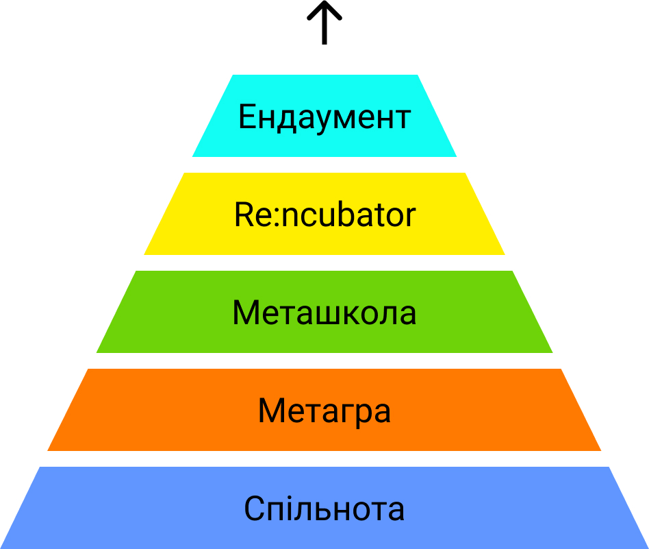

# Про екосистему

## Мета

* Досягення цілей сталого розвитку ООН
* Розвиток організаційної культури серед всіх стейкхолдерів

## План

Создать эффективную среду взаимодействия между бизнесом, НГО и государством через открытую платформу с такими органами:

### [Медиа](../media.md)

Донести до рынка концепцию креативной экономика, бирюзового менеджмента, экосистемного подхода, управление сложностью \(~400k украинцев\)

* Развивать канал Impact ua
* Создать профессиональное медиа с подкастами, статьями и вебинарами \(~vice, платформа, що биткоится\)
* Проект с Make it in Ukraine
* Проект с biggggidea
* Колонка на экономической правде

### [Сообщества](../analitika-mepping-dannykh/)

Объединить сообщество креативной экономики 

* Создать рост в сообщества через кросс-промо
* Развитьт возможности монетизации через спонсорство и спец проекты
* Объединить более 100 сообществ \(IT, креатив, бизнес, молодежь...\)
* 1000/все C-Level Украины люди в нашем сообществе \(СМО 300-400 чел\)

### [Метагра](../informacionnaya-kampaniya/) 

Разработать автоматизированную платформу для нетворкинга и повышения вовлечения

* Повысить количество повторных контактов
* Создать мануал эффективного нетворкинга \(Йорген\)
* Измеримый импакт

### [Меташкола](../shkola/)

Развить предпринимательские и софт скиллы членов сообществ для повышения resilience общества и экономического потенциала экосистем.

* Школа развития предпринимательства

### [Реінкубатор](../evolyuciya-organizacii/)

Создать устойчивые проектв в экосистеме

* Привлечь менторов, коучей и психологов для помощи в релизации целей команд
* Проект с ПРООН
* Проект с Министерством цифровой трансформации

### [Метафонд](../metafond.md) 

Насытить экосистему деньгами \($1M до конца 2020\) 

* Гранты на развитие креативной экономики от международных доноров
* Создать доход от внутренних сервисов экосистемы
* Открыть возможности для импакт инвестирования внутри экосистемы

## Идеи

* Выделить и описать бренд как продукт
* Показать систему как пирамиду / пищевую цепочку
* Вкладывать в импакт юа в развитие людей



