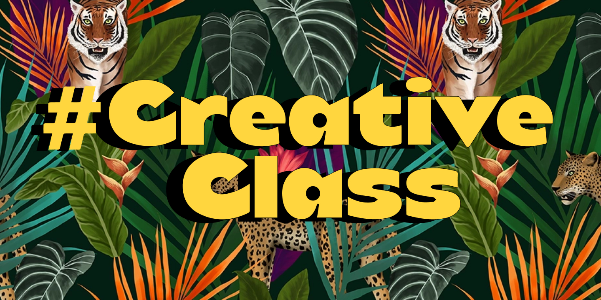

# 22.05

## Цели и апдейты

* Макс: развитие коммьюнити. Мы переформатируем в creative class
* Аркадий: развитие коммуникации между всеми людьми, которые хотят приходить. Пригласил пару людей, украинцы из Италии и Испании. Развивают экосистему. Минисообщество для развития экосистемы. Подключаться. Не знаю как коммуницировать с переводами. Хотел бы чтобы они занялись другими вещами. тк переводы мед материалов теряют актуальность
* Карина: запустить проект по медитациям. Вижу себя в роли ментора, не близко звание учителя. Родила название: НеймИтНот. Для всех этот путь о разном. Интересно подбирать практики под человека, по его запросам и целям. Онлайн-школа по медитации с регулярностью и индивидуальный гайдинг людей. Закончился опыт когда 10 дней вела 1 человека. Подстраивала. Интересно, хотела бы в таком направлении развиваться. Концепия себя – набор воспоминаний и оценочных суждений. Довольно странно называть это целостным. В кризисе рушится и становишься чем-то другим.

## Вопросы

### Макс / Как креативно заявить о конкурсе на бренд Creative Class

За долю в стартап инкубаторе 

* Написать балончиком под окнами креативных агентств
* Стикеры распечатать
* Сделать контекстную рекламу по имени
* Развесили плакаты по заборам \(что ты ненавидишь и белое пространство\), люди заполняли по всему городу
* выйти в оффлайн
* отправить подарки курьером
* [https://t.me/krutoznavstvo](https://t.me/krutoznavstvo)
* [https://www.facebook.com/vladyslav.volochai](https://www.facebook.com/vladyslav.volochai)
* рассказать на радиоаристократы
* х\*\*\*вое агентство
* купить баннер на улице
* плакаты в креативных школах
* заявить о себе, за счет того что подняли волну – стать замеченными
* публичный тендер между агенствами, выбирают люди

### Аркадий / Что нужно сделать чтобы переводчики остались с нами и поменяли свои роли?

Нужно понять чем они занимаются и что они могут делать в ключе. Важно подтянуть под мировую повестку. Мб взяться за рисерч, посмотреть что в других странах

Сейчас переводчики вне системы. Нужно чтобы зарегались и пришли на бар. Там уже понятнее.

Аналитические дайджесты. Описать возможности. Нужно больше информации. Могли бы внести в письмо. Из переводчиков, готовы 2-3 часа уделять. А есть кто не против.

Создать новое продуктовое видение – телеграм канал или сайт.

### Карина / Насколько бы вы оценили свое эмоциональное здоровье? что нужно чтобы добрать? Работает ли как-то с этим?

Эмоциональное здоровье – полное эмоциональное благополучие \(процветание, обеспеченность, спокойная и достаточная жизнь\). Энергия сбалансирована между разными сферами жизни. Принимаешь свой выбор в распределении.

Апатия &lt;–&gt; вдохновение. Эмоциональное здоровье это анти выгорания, тревожность, страх, злость. 

Связано с психологией. Уровень потока / вовлеченности в процесс. Умение абстрагироваться от тяжелых ситуаций. Пребывание здесь и сейчас, самодисциплина. Был высокий уровень тревожности и неверия, работал над этим. Работал с психотерапевтом, работали в фильтрами внимания. Прорабатывали насколько я верю как я воспринимаюсь со стороны. С другой стороны показала что люди мне доверяют, есть хорошие результаты. Узнал больше про свое внимание и снизилась тревожность. Как у Кастанеды, есть идея что наше я – это фасад нашего здания. Когнитивные искажения это может играть серьезную роль, мешать наслаждаться жизнью. Можно поставить на нужно место. Можно использовать свои фишки. 

Не осуждение. Над этим активно думаю и работаю над собой.

8 / 10. Искаженное восприятие опыта, если что-не получается, то как будто не имеет смысла. Коуч помагает регулярно. 

Сожаление смягчение сердца и ближе к сочувствию, эмпатии и прощению

6 / 10. Долгое время сдерживал себя в том что я хочу. Даже не говорил об этом в элементарных вещах. Был момент сдерживания. Теперь говорю. От этого другая перестройка, в возбужденном состоянии, на готове. Рад что так происходит. Как в спорте выбрасывается адреналин, потом входишь в поток через 10 мин.

## Рефлексия

Карина: благодарна что мы собираемся, классно что создалось безопасное пространство с работы стопковида и в меташколу переносится дух. Ощущение полного доверия к людям с которыми обсуждаешь. Супер комфортно. Начинаем что-то новое и не хочется слышать критики, но объективной оценки из любви. То что тут можно получить, за что я благодарна. 3 совсем разные темы, есть над чем подумать. Интересная задача.

Аркадий: спасибо, очень мало говорю об этих вещах. Это очень важно, когда варишься и проговариваешь эти моменты, можешь что-то не замечать, сдерживать. Не имеет выхода. Фильтр который мешает посмотреть, очень полезно, тоже опыт.

Макс: спасибо, очень благодарен.

* стыд
* депрессия
* ненависть злость
* ..
* благодарность
* \(нирвана\)

