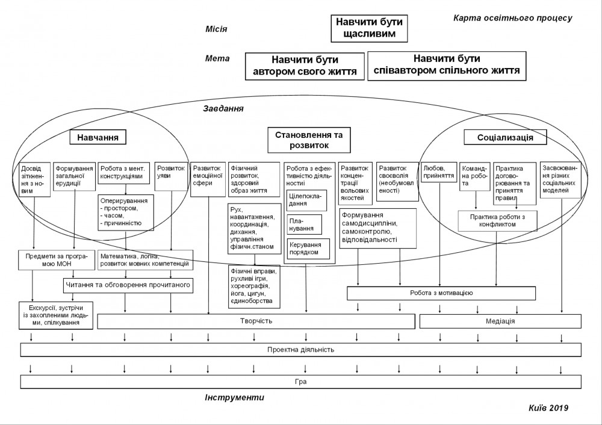

# Обучение

Education is a product for communities to drive integration, interaction and satisfaction.

Navigate complexity together: Shared intent, shared attention, shared resources

Кому стоит участвовать

* Людям, готовым делиться и учиться, открытым всему новому
* Координаторам, чья группа постоянно растет
* Выдающимся профессионалам в своей сфере
* Управляющим директорам крупных организаций
* Инвесторам которые ищут новые возможности и контакты

### Motto

* In this room is the power to change the world
* In me is the power to change the world
* If i'm going to change the world
* I need a world of change in me
* Change comes naturally
* But it can also come intentionally
* Through the power of goal setting & community
* I can achieve anything I put my mind to
* Everything is possible to the extent i believe it is
* I want to dream wide awake as much as i do asleep
* And through focused action we can do it \(30 days at a time\)

## Принципы

* EduScrum
* Regular reflection helps \(self and others\)
* Discipline matters a lot
* Healthy mind in the healthy body
* Fail fast, don't hold too much
* Every person is valuable
* Keep savings all the time and donate
* Если недоволен собой то недоволен и остальными
* Чтобы быть уверенным нужно больше изучать
* Чтобы любить надо познать

## Идеи

* курс-вебинар по лидерству, работе с волонтерами
* Критическое мышление, небинарное мышление \([реф](https://www.facebook.com/1763001290651097/posts/2619713674979850/?d=n)\)
* Ученики разрабатывают программу вместе с учителями
* Разработать курс развивающий основные идеи – оттуда можно брать в инкубацию
* Номинировать людей в меташколу \(как в лидерке\)
* Открыть список групп и наборы \(какие меня интересуют\)
* страница с расписанием
* Номинировать людей в меташколу
* Креативность – Craft, латеральнее мышление, дизайн мышление, ТРИЗ
* Ставьте оценки по Матчингу- это баллы, есть лидерборд
* Чтобы привести - ты должен заонбордить
* Массовые мастермайнды онлайн конфы
* Курс по 100 навыка КМ \(круглая картинка\)
* Конференция мастермайнд
* Beetroot партнер
* Обучение через вдохновение и ролевые модели в сообществах
* Бренд, сторителлинг
* Коммуникации
* Сообщества
* Обучение при поддержке сообщества
* Маркет валидейшен
* Описать концепции управления Ted, burning man, анонимных алкоголиков и тд
* Курс по реальному ТЗ \(как в сквоте\)
* Вотинг за менторов
* Курс саомоорганизации для сообществ
* \(для взрослых и детей\)
* студенты могут – можно сотрудничать со школами
* Делать упражнения на интегральное развитие
* Сообщество для повышения вовлечённости в онлайн образование \(а то не заканчивают курс\)
* Комьюнити менеджер t-shape skills
* Школа вокруг высших конфликтов
* Меташкола - знания по запросу
* [https://t.me/clubplatforma](https://t.me/clubplatforma)
* Принципы школы должны быть очень простыми и неоднозначными \(как в религии\)
* Цель Школы - реализация \(креативного\) потенциала человечества
* кто-то будет вести заметки
* мейби social school
* [https://www.theschooloflife.com/](https://www.theschooloflife.com/)
* Нужна айти система для этого движения \(метчинг, репутация и тд\)
* Суть школы - использовать collective intelligence
* Кто бы хотел быть адвайзором такого проекта?
* Разработайте курс который должны пройти депутаты
* Школа как место совершенствования. У тебя есть рефлективный элемент - Бадди или как-то
* Полицейским и социальным службам
* Меташкола на датриксе
* Меташкола - 50 человек нужно и метчить потом
* Mastermind на базе jitsi, найти инженера на форуме Джитси без денег или недорого
* Реакции как в онлайнбаре
* темы от людей, самому учиться
* Поговорить с разными инновационными школами, взять адйвайзорами
* Групповая встреча + потом взаимодействие 1:1
* Место в школе для ретрансляции основных идей. Так можно одновременно вести несколько задач
* Эту школу надо делать онлайн сразу!!!
* Внедрить децентрализацию в школу – фрактальный подход
* Ведение кого-то – способ разобраться самому
* Сначала дневник, потом группа, потом курс
* Открыть классы по топ скилам
* Познакомить учителей с самоорганизацией
* Teacher is one of the most rewarding careers
* Школа - человек приходит с запросом и все ему помогают и готовятся

* Мастермайнд как игра
* Ищем проблемы – находим группы
* Брать гранты чтобы отдавать количество лицензий по конкурсу
* Метчиться в больших группах по вопросам
* Кооператив только стартапы с классной идеей/историей и миссией
* More collaboration sessions
* Это сигналинг решение
* Это и есть айдишка
* Самый эффективный формат проведения мастермайнд групп
* Как сделать так чтобы люди это полюбили, нужен позитивный опыт. Как создавать позитивный опыт - обучая других людей
* Делать и показывать адопшен
* develop the use of collective intelligence
* Узнать как работают другие зебра инкубаторы - собрать мастермайнд
* В Y Combinator School было что-то вроде мастермайндов, можно узнать
* [https://www.facebook.com/nika.snizhko](https://www.facebook.com/nika.snizhko) занимается NLP
* Сделать брейкдаун текущих этериум звонков
* Get advise from that feedback guy
* Фасилитатор - выбирать текущую тему
* Указывать идею мастермайнд группы
* Классно считывать показатели с людей - грустно/весело и пульс если есть часы
* Берите культуру - шерьте дальше
* Community trello board - what needs to be done
* [https://designbundles.net/premium-logos/227361-mind-logo](https://designbundles.net/premium-logos/227361-mind-logo)
* Closed groups are paid
* С инвесторами коллабить идеи
* Чтобы участвовать в мастермайнде – донейтишь на гивете
* Conflict DJ
* Сделать самую большую мастермайнд сессию
* Ставить лайки людям после созвона
* Рейтинг решений в мастермайнды
* Сделать карту мастермайнд групп
* Поработать с блоггерами, предложить им группу
* Mastermind offline groups at conferences
* List of mastermind group ideas to website
* I forgot who started it
* Not just hang out, and then we can hang out
* Все время чистить группу и проводить голосования?
* "Балеетовская" группа
* Problem/Case based learning
* Telegram группа для отправки апдейтов о продукте
* Партнёрства доверия между мастермайндами
* Группировать предпринимателей по размеру и сфере вопросв
* Группа бесплатная платишь за неявку
* Рассказать про мечту про сети
* Graphcommons использовать как партнера по фронту
* Делать большую лабу у нас в офисе?
* по целям устойчивого развития
* Office hours with investors: Чтобы разбираться с defi проектами - нужно работать с defi проектами
* Use value map for product features
* Соцсети - способ коллабить быстрее
* Не спрашивать - просто просить помочь людей с проектами реинкубатора
* Спринт планинг сессии
* Геймификация работы
* Хакатоны для консультантов \(шоу и призы $10k\)
* Креативная Студия - набрать Креаторов и делать с ними
* Дейтинг агентство
* Строить связь которая поможет твоему росту, как в чёрном зеркале \(сказать что AI\)
* Экспертов взять из всех сообществ
* То что делает Мартын х100: Ставишь вопрос - нужный человек находится
* AI matchmaker
* Разбор кейсов
* org hackers sessions - брать кейсы в работу, мастермайнд как шоу
* Подписка: 1 интересный человек по твоему запросу в месяц
* Plugin в другие экслелераторы
* Нужно открывать публичные дизайн спринт сессии по конкурсу
* Инновации через тесты в хабах \(как в штатах\)
* User research, insights
* Платная подготовка кейса
* Дизайн сообщества по дизайн синкинг
* Делать дизайн концепты продуктов
* Мастермайнд бот
* ID по инвайтам, вопросы к тому кто привел
* Менторские встречи в Notion. На Personal Development Plan \(pdp\) контакта ментора
* Сократовский метод для выработки критического мышления
* Things are easy for you, and hard for me. We can make smth together.

[Про Энштейна](https://www.facebook.com/1539068219686026/posts/2015394728720037?d=n&sfns=mo)

Кому стоит участвовать

* Людям, готовым делиться и учиться, открытым всему новому
* Координаторам, чья группа постоянно растет
* Выдающимся профессионалам в своей сфере
* Управляющим директорам крупных компаний
* Инвесторам которые ищут новые возможности и контакты

